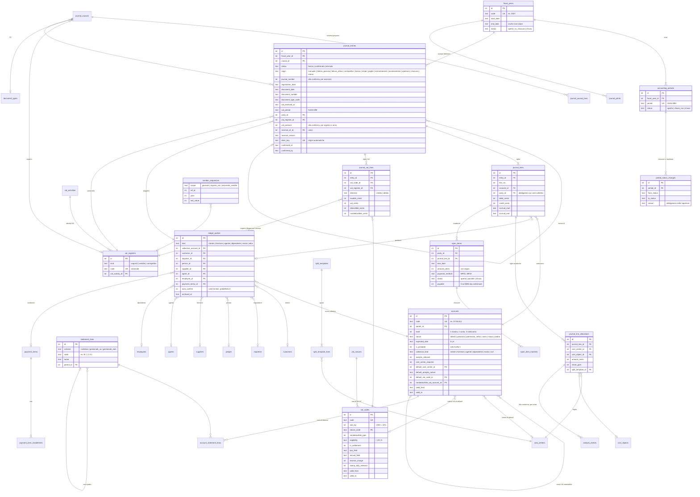
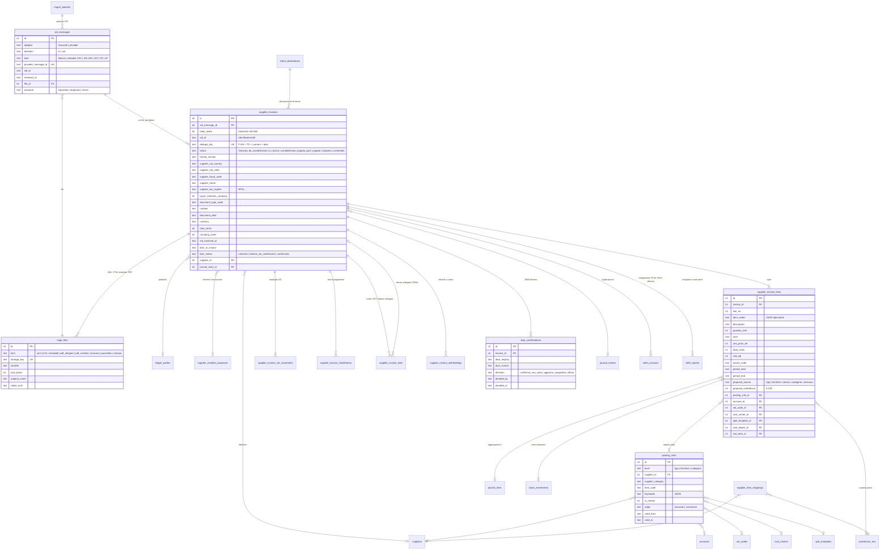

# Contabilità generale — Fase G0: audit e piano

Stato: **proposta, in attesa di decisioni** (25/09/2026). In questa fase non si modificano né il codice né lo schema.

Questo modulo **sostituisce la Fase 5** («Generale») di People e Finance v3. Le regole vincolanti sono quelle di v3 (esplorazione prima di scrivere, migrazioni versionate, centesimi interi, FK vere, anagrafiche uniche, eventi idempotenti, un test per ogni regola QUANDO/ALLORA, audit trail, permessi), più le sette regole della contabilità generale (partita doppia, immutabilità, numerazioni senza buchi, date distinte, tabelle fiscali come dati, tracciato FatturaPA isolato, tutto esportabile).

Base dell'audit:
- repository `cantina-booking`, branch `main` al commit `60c331c` (letto dal worktree `coge-g0`);
- lavoro di Produzione **in corso in un'altra sessione, non ancora su `main`**: migrazioni `0015_events_v2` … `0019_prd_cellar_master`, `lib/time.js`, `roles.capabilities`, ricostruzione di `cost_objects`. L'ho letto solo per restare coerente, senza toccarlo;
- dati di produzione: quelli rilevati dall'audit di Produzione il 25/09/2026 (non riletti su Railway).

Documenti collegati:
- [`eventi.md`](eventi.md): catalogo degli eventi della contabilità generale;
- [`regole.md`](regole.md): tutte le regole COG-xxx con il test previsto.

---

## 0. Sintesi

1. **Analitica di v3:** centri di costo, cascata e oggetti di costo ci sono e funzionano. I **movimenti analitici** invece sono solo manuali: niente origine «contabilità generale», niente ricavi, niente storni (si cancellano). Serve una versione 2 di `analytic_entries` prima di G1.
2. **Magazzino valorizzato** (Fase 3) è in produzione dal 25/09: costo medio ponderato continuo, valore alla data già disponibile. Manca il collegamento vero con la riga di fattura passiva.
3. **Costo standard del personale:** c'è il costo orario con storico e ci sono le ore approvate per centro. **Non c'è la valorizzazione** (ore × costo → movimenti analitici) né il conguaglio: è la Fase 4 di Finance, mai costruita. Blocca G6.3 (paghe) e G7 (raccordo), non G1–G2.
4. **Mono-azienda:** i dati dell'azienda sono chiavi di `settings`. Nessuna tabella «aziende», nessun `company_id`. Proposta: un database = una cantina. La separazione delle attività IVA (agricola, enoturismo) si gestisce con le **attività IVA**, non con più aziende.
5. **Anagrafiche:** clienti, importatori, fornitori e agenti hanno P.IVA, codice fiscale, IBAN, codice SDI e PEC, tutti in testo libero e senza unicità. `people` (che sostituisce `b2c_customers`) non ha né codice fiscale né indirizzo. Le anagrafiche si cancellano fisicamente: con la contabilità non si potrà più.
6. **SDI:** proposta (a) intermediario accreditato con API e webhook, dietro un **adapter** indipendente dal provider; (b) import manuale e massivo di XML, P7M e ZIP sempre attivo; (c) canale SDICoop proprio sconsigliato.
7. **File fiscali:** stesso archivio cifrato dei documenti HR (`lib/secure-files.js`), in una cartella e con una chiave separate, senza cancellazione. Conservazione a norma: servizio gratuito dell'Agenzia delle Entrate per le fatture; conservatore qualificato per i registri. MyWinery prepara i pacchetti e ne traccia l'esito.
8. **Migrazioni:** 20 migrazioni da G1 a G7. Numeri indicativi da `0027` (Produzione ha in programma fino alla `0026`); il numero definitivo si assegna quando si scrivono.
9. **Decisioni aperte:** 18 fiscali (da validare con il commercialista), 14 tecniche, 10 di prodotto (§ 12).

---

## 1. Esito dell'audit

### 1.1 Fasi 1–4 di v3: cosa c'è davvero

| Pezzo | Stato | Dove | Uso nella contabilità generale | Mancanze per la CoGe |
|---|---|---|---|---|
| Centri di costo ad albero | in produzione | `migrations/0004_cost_centers.js` (24 centri di partenza), `modules/finance.js:49` (`loadCenters`), `:72` (`assertImputable`: solo foglie, attive, valide alla data) | Centro obbligatorio sulle righe dei conti rilevanti per l'analitica; centro di default del conto e del fornitore | Nessuna. Il controllo «solo foglie attive e valide alla data» si riusa così com'è |
| Cascata (ribaltamenti) | in produzione | `migrations/0006_allocation.js`, `lib/cascade.js`, `modules/finance.js:450` (`gather`), `:494` (`allocation.run_confirmed`) | La cascata è a somma zero: il raccordo G7 confronta la generale con i costi **diretti**, prima della cascata | `gather()` legge **tutti** i movimenti del mese (`finance.js:450`). Quando entreranno i ricavi andrà filtrato sui soli costi, altrimenti la cascata ribalterebbe anche i ricavi |
| Oggetti di costo | in produzione; v2 in corso | `migrations/0005_cost_objects.js` (tipi fissi con `CHECK`), `modules/finance.js:9`; in corso `0017_cost_objects_v2` (parcella, ordine di lavoro, imbottigliamento) | Oggetto facoltativo sulle righe analitiche | Nessuna per G1–G2 |
| Movimenti analitici | in produzione, **solo manuali** | `migrations/0007_analytic_entries.js`, `modules/finance.js:411-440` | Alla conferma di una registrazione le righe analitiche diventano movimenti analitici, nella stessa transazione | `origin` ammette solo `'manuale'` (`CHECK`); nessuna FK al documento; `nature` solo di costo (`personale, materie, servizi, utenze, ammortamenti, altro`), niente ricavi; **la correzione è una cancellazione fisica** (`finance.js:438`), non uno storno; nessuna chiave di idempotenza. Vedi DT5 |
| Chiusura del periodo analitico | implicita | `modules/finance.js:40-46`: un mese è «chiuso» se la sua cascata è confermata | Una registrazione con righe analitiche in un mese già ribaltato va rifiutata (COG-M07) | Nessuna tabella `analytic_periods` (prevista dalla Fase 4 di v3) |
| Registro di magazzino valorizzato (Fase 3) | in produzione dal 25/09/2026 | `migrations/0014_stock_ledger.js`, `modules/stock.js:104` (`move`), `:277` (`valuation(date)`), `:307` (carico d'acquisto manuale) | Carico d'acquisto dalla fattura passiva (G2); valore delle rimanenze alla data di chiusura (G6–G7) | `stock_movements` ha `supplier_id`, `doc_number`, `doc_date` in testo, ma **nessuna FK alla riga di fattura**; il movimento ha l'oggetto di costo ma **non il centro**, che serve all'analitica al consumo; nessun codice articolo del fornitore su `warehouse_raw`. La data del movimento è `today()` in UTC |
| Costo orario standard | in produzione | `migrations/0008_org.js` (`employee_hourly_costs.cost_per_hour_e4`, con decorrenza), `0009` (`compensations`: RAL, proposta del costo orario) | Base del costo standard del personale (G6.3) | — |
| Ore per centro e oggetto | in produzione | `migrations/0012_timesheet.js` (`timesheet_allocations`: minuti per centro e oggetto), `modules/hr-timesheet.js:490` (`timesheet.month_approved` con `minutes_by_center`), `:614` (consumer `finance.ore-lavorate`) | — | Le ore alimentano solo il **driver** «Ore lavorate». **Nessun movimento analitico del costo del personale** (ore × costo standard) e nessun conguaglio standard/effettivo. Il payload dell'evento non ha l'oggetto di costo |
| Fase 4 di v3 (analitica: costo del venduto, personale a standard, costo del lotto, budget, provvigioni, periodi analitici) | **non costruita** | — | Consuma `stock.issued` e `timesheet.month_approved`; produce i «movimenti analitici diretti» che G7 confronta con la generale | Tutto. Nessun consumer di `stock.issued` (l'evento porta già il ricavo della riga) |
| Fase 5 di v3 (generale) | non costruita, sostituita da questo modulo | — | — | — |

**Conseguenza sull'ordine dei lavori.** G1 e G2 non dipendono dalla Fase 4: servono solo i centri, gli oggetti e una versione 2 di `analytic_entries`. G6.3 (paghe con «analitica da timesheet») e G7 (raccordo) invece hanno bisogno dei movimenti analitici diretti di tutte le origini, quindi della Fase 4 (§ 15).

### 1.2 Multi-azienda

**MyWinery oggi è mono-azienda.**
- I dati dell'azienda sono 12 chiavi di `settings` (`server.js:2760-2762`, `COMPANY_FIELDS`): ragione sociale, indirizzo, P.IVA, codice fiscale, codice SDI, PEC, telefono, email.
- Nessuna tabella di aziende; nessuna colonna `company_id`, `tenant_id` o simile in `server.js`, `modules/`, `lib/` e `migrations/`.
- Un solo database per installazione (`server.js:25-26`: `DATA_DIR`, `DB_PATH`), una sola sede di default (`0008_org.js`), un solo luogo di magazzino.
- Mancano, tra i dati dell'azienda, quelli che la FatturaPA e il bilancio chiedono: **regime fiscale** (RF01…), **REA** (ufficio, numero, capitale sociale, socio unico, stato di liquidazione), forma giuridica, conti bancari.

**Conseguenza** (proposta DT1):
- piano dei conti, esercizi, registri IVA e numerazioni sono **unici per database**. Nessun `company_id` nelle tabelle nuove;
- se MyWinery servirà più cantine, lo farà con **un'installazione (database) per cantina**, come oggi. Aggiungere `company_id` a posteriori su tutte le tabelle sarebbe un progetto a sé;
- il controllo del cessionario in G2 confronta la P.IVA del cessionario con `company_vat_number`;
- la **separazione delle attività IVA** (art. 36 DPR 633/72: per esempio produzione agricola e enoturismo) non è multi-azienda: stessa partita IVA, registri e liquidazioni separati per attività. Si modella con `vat_activities` collegata ai registri (§ 6.1).

### 1.3 Anagrafiche per i partitari

| Tabella | Ruolo nel partitario | P.IVA | Cod. fiscale | IBAN | Cod. SDI | PEC | Paese | Termini di pagamento | Eliminazione | Note |
|---|---|---|---|---|---|---|---|---|---|---|
| `customers` (`server.js:556`, colonne aggiunte `:571-585`) | cliente | `vat_number` | `fiscal_code` | `iban` | `sdi_code` | `pec` | `country` testo | `payment_terms` testo | **fisica** (`server.js:3809`), azzera `orders.customer_id` | `discount_percent` è `REAL`; indirizzo di spedizione separato |
| `importers` (`server.js:680`, `:749-751`) | cliente (estero) | `vat_number` | `fiscal_code` | `iban` | `sdi_code` | `pec` | `country` testo | `payment_terms` testo | **fisica** (`server.js:4089`) | `incoterms` utile per Intrastat e prova dell'esportazione |
| `people` (`server.js:635`) | cliente privato | — | **manca** | — | — | — | — | — | **fisica** (`server.js:3940`) | Sostituisce `b2c_customers` e `contacts` (deprecate). Senza codice fiscale e indirizzo non si emette una fattura a un privato |
| `b2c_customers` | — | — | — | — | — | — | — | — | — | **Deprecata**, non più scritta. Il brief la cita, ma il partitario va su `people` |
| `suppliers` (`server.js:718`, `:752-754`) | fornitore | `vat_number` | `fiscal_code` | `iban` (uno solo) | `sdi_code` | `pec` | `country` testo | `payment_terms` testo | **fisica** (`server.js:4141`) | `category` testo libero (0 fornitori in produzione); `discount_percent` `REAL` |
| `agents` (`server.js:536`, `:586-605`) | fornitore (provvigioni) | `vat_number` | `fiscal_code` | `iban` | `sdi_code` | `pec` | `country` | `payment_terms` | **fisica** (`server.js:3731`) | `enasarco_number`, `contract_type`; `commission_percent` è `REAL` |
| `employees` + `employee_personal` (`0008`, `0009`) | dipendente | — | `fiscal_code` (unico) | `iban` | — | — | — | — | non si elimina se ha un fascicolo | CF e IBAN sono di livello **personale**, le retribuzioni di livello **retributivo** (vedi DF15) |
| `settings` `company_*` | cedente / cessionario | `company_vat_number` | `company_fiscal_code` | — | `company_sdi_code` | `company_pec` | `company_country` | — | — | Mancano regime fiscale, REA, conti bancari |

Osservazioni:
- **Nessuna unicità** su P.IVA o codice fiscale, nessuna normalizzazione (prefisso paese, spazi). La P.IVA senza `IdPaese` non basta per la FatturaPA e per distinguere UE ed extra-UE. Il paese è testo libero (`orders.customer_country` viene dall'import Excel, `server.js:3154`).
- **Termini di pagamento in testo libero.** Oggi la scadenza dell'ordine è «data ordine + il primo numero che compare nel testo» (`parsePaymentTermsDays`, `server.js:1685`). Per lo scadenzario servono rate, fine mese e modalità: una tabella `payment_terms` strutturata, collegata alle anagrafiche senza cancellare il testo (DT11).
- **Eliminazione fisica** di clienti, importatori, fornitori, agenti e persone: un soggetto con movimenti contabili non si potrà più eliminare, solo disattivare (COG-M14). È un cambiamento di comportamento dei moduli esistenti, da approvare (DT10).
- **Un soggetto con più ruoli** (per esempio una cantina che è cliente e fornitore) ha due partitari, uno per ruolo, sulla stessa anagrafica.

### 1.4 Documenti esistenti che la contabilità consumerà

| Documento | Dove | Dati utili | Cosa manca | Fase |
|---|---|---|---|---|
| Ordini B2B (`orders`, `order_items`) | `server.js:503`, `:518`; stati da `PATCH /api/admin/orders/:id` (`server.js:3101`), nessun controllo sui valori | cliente, **cliente di fatturazione** (`billing_customer_id`), agente, canale (testo), listino, totale e sconti, stato «evaso» (scarico di magazzino, `stock.js:202`) | aliquota IVA e natura per riga, numero e data della fattura, collegamento alla fattura. `discount_percent` è `REAL` | G3, G6 (fatture da emettere) |
| Stato di pagamento (`orders.payment_status`, `paid_at`, `payment_due_date`) | solo `PATCH /api/admin/orders/:id/payment` manuale (`server.js:4684`); letto da dashboard e dal portale agenti «recupero crediti» (`server.js:1547`, `:3435`, `:3623`) | — | Diventerà un **dato derivato** dallo scadenzario (G3–G4). Cambia il flusso manuale di oggi (DP7) | G3, G4 |
| Vendite in cassa (`shop_sales`, `shop_sale_items`) | `server.js:2663` (creazione), `:2704` (annullo che non cancella), contesti e metodi `:2639-2640` | contesto (`negozio`, `post_visita`, `post_evento`) → centro; metodo (`contanti`, `carta`, `altro`); totale; annullo tracciato | **Nessuna aliquota IVA** su righe e prodotti (`products` non ha codice IVA, `server.js:453`); nessun collegamento al registratore telematico | G3 (corrispettivi) |
| Ritiri online (`pickup_orders`) | webhook Stripe `server.js:1767` (idempotente), ritiro `:2733` | importo, `payment_intent_id`, stato | commissioni e payout Stripe | G3 |
| Prenotazioni (`bookings`) | webhook `server.js:1748`, conferma manuale `:2382` | importo, sconto, `stripe_session_id`, `payment_intent_id` | commissioni, payout. Il webhook **non è idempotente** per le prenotazioni (vedi COG-X05) | G3 |
| Eventi in location (`venue_events`) | `server.js:2585` | canone, caparra, flag `deposit_paid`, stato | nessun pagamento registrato (solo un flag); `crm_customer_id` senza FK | G3 |
| Registro di magazzino | `modules/stock.js` | valore alla data (`valuation`), costo del venduto con il ricavo in `stock.issued` | FK alla riga di fattura passiva | G2, G6, G7 |
| Costo orario, ore per centro | `0008`, `0012` | costo standard | valorizzazione (Fase 4) | G6.3 |
| Stripe | `server.js:22-28`, `:1732` | sessioni e payment intent | charge, balance transaction, commissioni, payout: nulla è salvato. **Stripe non è attivo in produzione** | G3–G4 |
| Banca | — | — | nulla | G4 |

### 1.5 Dati reali (dall'audit di Produzione del 25/09/2026)

- `orders`: **0**; `suppliers`: **0**; `products`: 3, senza SKU né codice IVA; magazzino vuoto; Stripe ed email non attivi.
- Conseguenza: **nessun dato storico da migrare** nei moduli esistenti. I saldi di apertura e le partite aperte verranno dal gestionale contabile di oggi (del commercialista o dell'amministrazione): vedi DP6.

### 1.6 Logiche implicite di oggi, in formato QUANDO/ALLORA (da validare)

| ID | Regola di oggi |
|---|---|
| COG-X01 | QUANDO si crea un ordine ALLORA `payment_status` = non pagato e la scadenza = data ordine + il primo numero trovato nei termini di pagamento del cliente (`server.js:1685`, `:4543`) |
| COG-X02 | QUANDO qualcuno cambia lo stato di pagamento ALLORA `paid_at` = adesso se «pagato», altrimenti vuoto; nessuna traccia di chi, nessun importo parziale (`server.js:4684`) |
| COG-X03 | QUANDO un ordine non è «pagato» ALLORA il suo totale conta come credito aperto nel portale agenti e nelle dashboard (`server.js:1547`, `:3444`) |
| COG-X04 | QUANDO si elimina un fornitore, un cliente, un importatore, un agente o una persona ALLORA il record sparisce e i collegamenti si azzerano (`server.js:4141`, `:3809`, `:4089`, `:3731`, `:3940`) |
| COG-X05 | QUANDO Stripe consegna due volte `checkout.session.completed` di una prenotazione ALLORA lo stato si riscrive, l'uso del codice sconto si conta due volte e l'email parte due volte (`server.js:1748-1759`). Per i ritiri online invece è idempotente (`:1767`). Difetto esistente, da correggere prima di G3 |
| COG-X06 | QUANDO si registra un carico d'acquisto a mano ALLORA fornitore, numero e data del documento sono testo sul movimento, senza collegamento a una fattura (`stock.js:307-320`) |
| COG-X07 | QUANDO si cancella un costo diretto manuale in un mese non ribaltato ALLORA il movimento analitico sparisce (`finance.js:434-440`) |

---

## 2. Canale SDI

### 2.1 Confronto

| | (a) Intermediario accreditato con API REST e webhook | (b) Import manuale o massivo di XML, P7M e ZIP | (c) Canale proprio SDICoop / SDIFTP |
|---|---|---|---|
| Cosa serve | contratto con un intermediario; il suo **codice destinatario** registrato sul portale Fatture e Corrispettivi; credenziali API | niente: file scaricati dal portale dell'Agenzia (Fatture e Corrispettivi, anche in blocco come ZIP), dalla PEC o dal gestionale di oggi | accreditamento del canale presso SDI, certificati, web service SOAP o SFTP, test di interoperabilità, presidio continuo |
| Ricezione passive | automatica: webhook (o polling) → download del file e dei metadati | a mano o in blocco | automatica |
| Invio attive e integrazioni (TD16–TD19) | automatico, con le ricevute (RC, NS, MC) | **no**: si genera l'XML, lo si carica sul portale dell'Agenzia, poi si caricano le ricevute | automatico |
| Data di ricezione SDI | dai metadati del provider | dal file metadati (se presente) o inserita a mano, con avviso | dai metadati |
| Conservazione | spesso inclusa nel servizio | no | a parte |
| Costo | canone o costo per documento del provider (da confrontare: non stimo prezzi) | zero | alto in sviluppo e manutenzione |
| Rischio | dipendenza dal provider (mitigata dall'adapter) | errori manuali, ritardi, date di ricezione mancanti | alto: disponibilità, sicurezza, aggiornamenti delle specifiche a carico nostro |
| Proposta | **raccomandato per partire** | **sempre attivo**, come fallback e per gli storici | **sconsigliato ora** |

Intermediari noti da **valutare** (solo esempi, senza giudizio né prezzi): Aruba, InfoCert, Namirial, A-Cube, Openapi, TeamSystem / Fatture in Cloud. Criteri di scelta proposti:
1. API REST documentate per invio, ricezione e notifiche, con **webhook firmati** e polling come alternativa;
2. accesso ai **metadati SDI** (identificativo SdI, data di ricezione) e ai file originali (XML e P7M), non solo a una versione rielaborata;
3. ambiente di prova;
4. conservazione a norma inclusa o integrabile, con esportazione dei pacchetti;
5. validazione dell'XML prima dell'invio e aggiornamento tempestivo delle specifiche;
6. export completo dei documenti in caso di cambio di provider;
7. contratto e nomina a responsabile del trattamento (GDPR).

**Attenzione al codice destinatario.** Le fatture passive arrivano all'indirizzo registrato sul portale dell'Agenzia. Se oggi è quello del commercialista o di un altro software, passare all'intermediario cambia il flusso anche per loro. Va deciso con il commercialista, con una data di passaggio precisa (DF16).

### 2.2 Interfaccia dell'adapter

Tutto il resto del modulo parla solo con questa interfaccia (`modules/coge/sdi/adapter.js`). Ogni provider è un file a parte. L'adapter `manuale` c'è sempre.

```js
// Contratto dell'adapter SDI. I file viaggiano come Buffer; le date in ISO UTC.
// Ogni metodo è idempotente rispetto a providerMessageId.
{
  name: 'manuale' | 'provider-x' | ...,
  capabilities: { receive: 'webhook' | 'polling' | 'upload', send: boolean, notifications: boolean, conservation: boolean },

  // Ricezione delle passive
  async listInbound({ since, cursor }),        // → { items: [{ providerMessageId, sdiId, receivedAt, fileName }], nextCursor }
  async fetchInbound(providerMessageId),       // → { invoiceFile: Buffer, fileName, metadataFile: Buffer|null, sdiId, receivedAt }
  async ackInbound(providerMessageId),         // conferma al provider che il documento è stato salvato

  // Invio delle attive e delle integrazioni
  async send({ fileName, xml }),               // → { providerMessageId, submittedAt }
  async fetchNotifications({ since, cursor }), // → [{ providerMessageId, kind: 'RC'|'NS'|'MC'|'EC'|'DT'|'AT', sdiId, at, file, fileName }]

  // Webhook: verifica della firma e traduzione in eventi normalizzati. Il contenuto del webhook
  // non si usa come dato: serve solo a sapere che c'è qualcosa da scaricare con fetchInbound().
  verifyWebhook(req),                          // → { ok: boolean, hints: [{ type: 'inbound'|'notification', providerMessageId }] }
}
```

Regole comuni a tutti gli adapter:
- **ogni messaggio** (fattura ricevuta, ricevuta, notifica) si salva prima come file cifrato e come riga di `sdi_messages`, con `providerMessageId` unico; solo dopo si elabora;
- **webhook come avviso, non come fonte**: si riscarica il documento con l'API; se il webhook non arriva, un job di polling ogni 15 minuti recupera ciò che manca;
- endpoint pubblico `POST /api/sdi/webhook/:adapter`, fuori da `/api/admin`, con verifica della firma; segreti solo in variabili d'ambiente;
- lo scheduler di oggi esegue job **sincroni** (`lib/scheduler.js`): il polling, che fa chiamate HTTP, richiede il supporto dei job asincroni (DT3);
- l'import manuale (`manuale`) accetta XML, P7M, ZIP (anche quelli scaricati in blocco dal portale dell'Agenzia, con i file metadati) e registra per ogni file l'esito: importato, duplicato, errore.

### 2.3 Flussi

**Ricezione:** file ricevuto → salvato cifrato → estratto dal P7M se firmato → riconosciuta la versione del tracciato → per **ogni** `FatturaElettronicaBody` (un file può contenere più fatture, «lotto») una `supplier_invoices` → deduplica → abbinamento al fornitore → proposta di contabilizzazione → bozza o conferma automatica.

**Invio:** documento confermato in bozza → XML generato e validato → inviato → `inviata` → ricevuta di consegna (`consegnata`, registrazione confermata con protocollo), mancata consegna (`non_consegnata`: la fattura è emessa, si avvisa il cliente) o scarto (`scartata`: torna modificabile con **stesso numero e data**, entro i termini).

---

## 3. Archiviazione e conservazione

### 3.1 Dove si salvano i file

Si riusa l'archivio cifrato dei documenti HR (`lib/secure-files.js`, collegato in `server.js:5164-5165`): AES-256-GCM, file `<uuid>.bin` sul volume, impronta SHA-256 nel database, un file alterato non si apre.

| Scelta | Proposta |
|---|---|
| Cartella | `DATA_DIR/coge-files/`, separata da `hr-files/` |
| Chiave | variabile **`COGE_FILES_KEY`**, separata da `HR_FILES_KEY` (DT2). Serve una piccola generalizzazione di `resolveKey` e dei messaggi, oggi scritti per l'HR |
| Registro dei file | tabella `coge_files`: tipo, chiave d'archivio, SHA-256, dimensione, nome originale, MIME, data di ricezione, «conservare fino al» |
| Tipi | XML della fattura, P7M originale, file metadati SDI, PDF allegati all'XML, PDF di cortesia, ricevute SDI (RC, NS, MC…), estratti conto (G4), riepiloghi paghe (G6), pacchetti di conservazione, stampe definitive |
| Cancellazione | **nessuna API di cancellazione**. Il file originale non si sostituisce mai: una correzione è un documento nuovo |
| Durata | almeno 10 anni dall'ultima registrazione (art. 2220 c.c.) e comunque fino alla definizione degli accertamenti: parametro in `coge_config`, da validare |
| Accesso | download con link firmato a scadenza (`lib/security.js:59`, `signUrl`), come i documenti HR |
| Dimensioni | una fattura XML pesa pochi kB; il volume ha 50 GB con meno di 1 GB usato |

**Rischi da chiudere prima dell'uso reale:**
- **backup del volume** (in sospeso dalla Fase 0 di v3, domanda SIS-04): con i documenti fiscali diventa obbligatorio;
- **copia della chiave** fuori da Railway: senza chiave i documenti fiscali non si aprono più. La copia conservata a norma presso l'Agenzia o il conservatore è la seconda difesa.

### 3.2 Conservazione digitale a norma

| Cosa | Proposta | Chi decide |
|---|---|---|
| Fatture elettroniche passate da SDI (attive, passive, integrazioni TD16–TD19) | **servizio gratuito dell'Agenzia delle Entrate** (adesione dal portale Fatture e Corrispettivi), se non è già attivo con il commercialista o con il provider | commercialista (DF14) |
| Registri e libri (libro giornale, registri IVA, libro inventari, stampe definitive) | il servizio dell'Agenzia **non li copre**: conservatore qualificato secondo le Linee guida AgID, spesso lo stesso intermediario SDI o il servizio del commercialista | commercialista |
| Altri documenti (fatture estere cartacee o PDF, estratti conto, contratti) | stesso conservatore dei registri | commercialista |

MyWinery, in ogni caso:
- **prepara i pacchetti di versamento** per periodo e tipo: file originali, indice dei metadati (identificativo, date, soggetti, impronte SHA-256) nel formato chiesto dal conservatore;
- **traccia l'esito**: preparato → inviato → preso in carico → conservato, oppure rifiutato con il motivo; salva il **rapporto di versamento**;
- **avvisa** prima della scadenza di legge (oggi, entro il terzo mese dal termine della dichiarazione dei redditi: parametro da validare);
- con un provider che espone la conservazione via API, l'invio passa dall'adapter; altrimenti il pacchetto si scarica e si carica a mano, e l'esito si registra a mano.

---

## 4. Tracciato FatturaPA: un modulo isolato

- **Versione:** il brief indica la **1.9.1**, operativa dal 15/05/2026. Prima di G2 va verificata sulle specifiche pubblicate dall'Agenzia (DF17). La versione del file si riconosce dal file stesso, così convivono gli storici delle versioni precedenti.
- **Dove:** `lib/fatturapa/`, senza dipendenze dal resto dell'app:
  - `p7m.js`: estrae il contenuto firmato CAdES (DER, BER a lunghezza indefinita, base64). La firma non si riverifica: l'ha già controllata SDI. Si conserva il P7M originale;
  - `parse.js`: da XML a un oggetto normalizzato (importi in centesimi, prezzi unitari in `e8` perché il tracciato ammette fino a 8 decimali, aliquote in punti base: 22% = 2200), con gli errori per campo;
  - `generate.js`: da un documento normalizzato a XML (TD01, TD02, TD04, TD24, TD16–TD19…);
  - `render.js`: vista leggibile in HTML dal documento normalizzato, pensata per la stampa e il «Salva come PDF», come le stampe di Produzione. **Niente XSLT nel browser**: la dismissione di XSLT è stata annunciata dai browser basati su Chromium;
  - `tables.js`: nessuna tabella fiscale qui dentro, solo la struttura del tracciato. Tipi documento, nature, modalità di pagamento stanno nel database (regola 5).
- **Test** su file XML di esempio (§ 10.3); un cambio di versione tocca solo questa cartella e i suoi test.
- **Dipendenze** (DT14): Node non ha un parser XML né un lettore ZIP. Proposta: `fast-xml-parser` e `fflate`, entrambe in puro JavaScript (nessuna dipendenza nativa, come vuole il progetto); per validare l'XML generato contro lo schema XSD ufficiale, solo nei test, `xmllint-wasm`. In alternativa si scrivono a mano, con più rischio.

---

## 5. Principi del motore contabile

| Tema | Scelta |
|---|---|
| Partita doppia | Alla conferma, nella stessa transazione: somma Dare = somma Avere al centesimo, almeno due righe, nessuna riga con Dare e Avere insieme o entrambi a zero. Un job notturno ricontrolla tutte le registrazioni confermate e le righe analitiche; una differenza è un'anomalia bloccante con notifica (COG-V01) |
| Immutabilità | Le bozze si modificano liberamente. Una registrazione confermata non si modifica e non si cancella: **storno** speculare collegato (con motivo obbligatorio) più una nuova registrazione. Lo storno inverte anche i movimenti analitici. Nessuna API di DELETE sulle confermate; un test lo verifica per ogni route |
| Numerazioni | Tabella `number_sequences` (ambito, registro o sezionale, anno, ultimo numero). Il numero si assegna **solo alla conferma**, con `UPDATE … SET last_value = last_value + 1 … RETURNING` nella stessa transazione: se la conferma fallisce, il numero non è consumato. Indici unici come ultima difesa. Oggi l'app ha un solo processo e l'API di SQLite è sincrona, quindi due conferme non si sovrappongono; il disegno regge anche con più processi o con Postgres (lock di riga) |
| Ordine cronologico | La data di registrazione di una nuova conferma non precede l'ultima confermata dell'esercizio (giornale) né l'ultima del registro IVA (protocollo): numeri e date restano nello stesso ordine (COG-M12) |
| Date | Sempre salvate, distinte: registrazione, documento, ricezione SDI, periodo IVA, competenza economica inizio/fine. Le date fiscali si calcolano **in ora italiana** con `lib/time.js` (in arrivo con Produzione, DP6): una fattura ricevuta il 1° ottobre alle 00:30 italiane non deve risultare del 30 settembre |
| Saldi | Mastrini, partitari e bilancio di verifica si calcolano dalle righe, con indici su conto, periodo e soggetto. Nessun contatore aggiornato a parte |
| Tabelle fiscali | Aliquote e codici IVA, nature, tipi documento, modalità di pagamento, codici tributo, indetraibilità, compensazioni, coefficienti di ammortamento, regole di detrazione: tabelle con validità temporale. Parametri come la soglia del bollo in `coge_config`, con «da validare», chi l'ha validato e quando (come `prd_config`) |
| Precisione | Importi in centesimi; aliquote in punti base; indetraibilità, compensazioni e ripartizioni in ppm; quantità in millesimi; prezzi unitari dell'XML in `e8`. Ripartizioni con `allocate()` di `lib/money.js` (resto sull'ultima quota) |
| Analitica | Righe analitiche sulle righe contabili dei conti rilevanti, somma uguale alla riga al centesimo. Alla conferma diventano `analytic_entries` con origine «contabilità generale» e FK alla riga analitica, nella stessa transazione. Competenza su più mesi: una riga analitica per mese, in proporzione ai giorni |
| Permessi | Workspace `finance` (voce `coge` in `API_WORKSPACES`, `lib/security.js:75`) più capacità per azione su `roles.capabilities` (in arrivo con Produzione): `coge_operatore` (bozze), `coge_contabile` (conferma, storno), `coge_responsabile` (riapertura dei periodi, chiusura dell'esercizio, conferma di un IBAN diverso, conferma automatica dei fornitori), `coge_sola_lettura`, `coge_export` (commercialista) |
| Audit | `audit_log` su conferme, storni, riaperture, conferme IBAN, regole di contabilizzazione; `created_at/by`, `updated_at/by` su tutte le tabelle nuove, `confirmed_at/by` sulle registrazioni |
| Export | Giornale, mastrini, registri IVA, bilancio di verifica, partitari in Excel (dipendenza `xlsx` già presente) e stampa HTML; tracciato configurabile per il gestionale del commercialista (G7, DF18) |

---

## 6. Modello dati (ERD)

Tutte le tabelle hanno `created_at`, `created_by`, `updated_at`, `updated_by`; le anagrafiche contabili hanno anche `archived_at`. Gli importi sono `INTEGER`.

### 6.1 G1 — Motore contabile



Note al modello:
- `ledger_parties` è il **partitario**: collega un'anagrafica esistente a un conto collettivo, senza copiarne nome, P.IVA o indirizzo. Un `CHECK` impone esattamente un collegamento per riga e il tipo coerente con il conto;
- `vat_natures`, `document_types`, `payment_methods`, `vat_deduction_rules`, `coge_config` sono tabelle di dati con validità, non codice;
- i **modelli di ripartizione** si chiamano `split_templates` per non confonderli con le regole della cascata (`allocation_rules`);
- `analytic_entries` v2 (DT5): + `kind` (`costo` | `ricavo`), + nature di ricavo, + origine `coge` con FK `journal_line_allocation_id`, + `accrual_period`, + `reverses_id` al posto della cancellazione per le origini automatiche.

### 6.2 G2 — Ciclo passivo



### 6.3 G3–G7 — panoramica

```mermaid
erDiagram
  sales_invoices ||--|{ sales_invoice_lines : ""
  sales_invoice_lines }o--o| order_items : "da ordine evaso"
  sales_invoices }o--o| venue_events : "evento"
  sales_invoices }o--o| ledger_parties : "cliente"
  sales_invoices ||--o{ sdi_messages : "invio e ricevute"
  sales_invoices }o--o| intent_declarations : "esportatore abituale"
  daily_receipts ||--|{ daily_receipt_lines : "per aliquota e contesto"
  daily_receipt_lines }o--o{ shop_sales : "vendite del giorno"
  stripe_balance_transactions }o--o| bookings : ""
  stripe_balance_transactions }o--o| pickup_orders : ""
  stripe_payouts ||--o{ stripe_balance_transactions : ""
  bank_accounts }o--|| accounts : "conto banca"
  bank_accounts ||--o{ bank_statements : "CBI, CAMT.053, CSV"
  bank_statements ||--|{ bank_transactions : ""
  bank_transactions ||--o{ reconciliation_matches : ""
  reconciliation_matches }o--o| open_items : ""
  reconciliation_matches }o--o| stripe_payouts : ""
  reconciliation_rules ||--o{ reconciliation_matches : "proposte"
  payment_orders ||--|{ payment_order_lines : "SEPA pain.001"
  payment_order_lines }o--|| open_items : ""
  collection_orders ||--|{ collection_order_lines : "RIBA, SDD"
  f24_forms ||--|{ f24_lines : ""
  f24_lines }o--|| tax_payment_codes : "codici tributo"
  vat_settlements ||--|{ vat_settlement_lines : "per registro e attività"
  vat_settlements }o--o| journal_entries : "giroconto IVA"
  compensation_rates }o--o| products : "art. 34"
  plafond_movements }o--|| intent_declarations : ""
  stamp_duty_quarters ||--o{ sales_invoices : "bollo virtuale"
  conservation_packages ||--|{ conservation_package_items : ""
  conservation_package_items }o--|| coge_files : ""
  asset_categories ||--o{ fixed_assets : "coefficienti per data"
  fixed_assets }o--o| supplier_invoice_lines : "acquisto"
  fixed_assets }o--|| cost_centers : ""
  fixed_assets ||--o{ fixed_asset_events : "entrata, dismissione"
  depreciation_runs ||--|{ depreciation_lines : "una per cespite e periodo"
  depreciation_runs }o--o| journal_entries : ""
  closing_adjustments }o--o| journal_entries : "assestamento e storno"
  payroll_imports ||--|{ payroll_import_lines : ""
  payroll_imports }o--o| journal_entries : ""
  coge_coan_reconciliations ||--|{ coge_coan_reconciliation_items : "prospetto di raccordo"
  figurative_costs }o--|| cost_centers : "solo analitica"
  year_closings }o--|| fiscal_years : ""
  export_layouts ||--o{ export_runs : "tracciati per il commercialista"
```



Le colonne di G3–G7 si dettagliano nelle rispettive fasi.

---

## 7. Piano delle migrazioni

Ultima migrazione su `main`: **`0014_stock_ledger`**. Produzione sta scrivendo `0015`–`0019` e ne ha in programma fino alla `0026`; la Fase 4 di Finance non ha ancora numeri. Per evitare collisioni (il runner ordina per numero e annulla solo l'ultima, `lib/migrations.js:77`):
- i numeri qui sotto sono **indicativi**, da `0027`;
- il numero definitivo si assegna quando la migrazione si scrive, subito dopo l'ultima presente su `main`;
- ogni migrazione ha il suo `down` ed è preceduta dalla copia automatica del database.

| Fase | Migrazione | Tabelle nuove | Tabelle **esistenti** toccate |
|---|---|---|---|
| G1 | `0027_coge_fiscal_tables` | `vat_natures`, `document_types`, `payment_methods`, `vat_codes`, `vat_activities`, `vat_deduction_rules`, `payment_terms`, `payment_term_installments`, `coge_config` (seed tutti «da validare») | — |
| G1 | `0028_coge_chart` | `fiscal_years`, `accounting_periods`, `period_status_changes`, `statement_lines`, `accounts`, `account_statement_lines`, `ledger_parties`, `vat_registers`, `journal_causals`, `journal_causal_lines`, `split_templates`, `split_template_lines`, `number_sequences` | — |
| G1 | `0029_coge_journal` | `journal_entries`, `journal_lines`, `journal_vat_lines`, `journal_line_allocations`, `open_items`, `open_item_matches`, `journal_prints` | — |
| G1 | `0030_analytic_entries_v2` | — | `analytic_entries` **ricostruita** (`disableForeignKeys`, come la `0017` di Produzione): `kind`, nature di ricavo, origini `coge` (e quelle della Fase 4, da concordare: DT5), FK `journal_line_allocation_id`, `accrual_period`, `reverses_id`, `idem_key` |
| G1 | `0031_coge_seed` | — (solo dati) piano dei conti vitivinicolo, voci dello schema civilistico, causali, codici IVA e registri di partenza | — |
| G2 | `0032_coge_files_sdi` | `coge_files`, `sdi_messages`, `import_batches` | — |
| G2 | `0033_supplier_invoices` | `supplier_invoices`, `supplier_invoice_lines`, `supplier_invoice_vat_summaries`, `supplier_invoice_installments`, `supplier_invoice_links`, `supplier_invoice_withholdings`, `supplier_invoice_files`, `supplier_creation_proposals`, `iban_confirmations`, `posting_rules`, `supplier_item_mappings`, `td29_reports` | — |
| G2 | `0034_stock_supplier_invoice` | — | `stock_movements`: + `supplier_invoice_line_id` (FK, `ON DELETE SET NULL` non serve: le righe non si cancellano) |
| G2 | `0035_intent_declarations` | `intent_declarations`, `plafond_movements` | — |
| G3 | `0036_sales_invoices` | `sales_invoices`, `sales_invoice_lines`, `sales_invoice_vat_summaries` (anche integrazioni TD16–TD19) | `products`: + codice IVA e categoria contabile (con il vostro via, DP9) |
| G3 | `0037_daily_receipts` | `daily_receipts`, `daily_receipt_lines` | — |
| G3 | `0038_stripe_ledger` | `stripe_balance_transactions`, `stripe_payouts` | — |
| G3 | `0039_people_fiscal` | — | `people`: + codice fiscale e indirizzo di fatturazione (solo con il vostro via, DT12) |
| G4 | `0040_treasury` | `bank_accounts`, `bank_statements`, `bank_transactions`, `reconciliation_rules`, `reconciliation_matches`, `payment_orders`, `payment_order_lines`, `collection_orders`, `collection_order_lines`, `f24_forms`, `f24_lines`, `tax_payment_codes` | — |
| G5 | `0041_vat_settlement` | `vat_settlements`, `vat_settlement_lines`, `compensation_rates`, `stamp_duty_quarters`, `vat_exports` (LIPE, dati della dichiarazione) | — |
| G5 | `0042_conservation` | `conservation_packages`, `conservation_package_items` | — |
| G6 | `0043_fixed_assets` | `asset_categories`, `depreciation_coefficients`, `fixed_assets`, `fixed_asset_events`, `depreciation_runs`, `depreciation_lines` | — |
| G6 | `0044_closing_adjustments` | `closing_adjustments` | — |
| G6 | `0045_payroll` | `payroll_layouts`, `payroll_imports`, `payroll_import_lines` | — |
| G7 | `0046_coge_coan_closing` | `figurative_costs`, `coge_coan_reconciliations`, `coge_coan_reconciliation_items`, `year_closings`, `export_layouts`, `export_runs` | — |

Nessuna migrazione cancella o rinomina colonne esistenti. Le ricostruzioni (`analytic_entries`) mantengono gli id, come la `0017` di Produzione.

---

## 8. Catalogo degli eventi (sintesi)

Il dettaglio è in [`eventi.md`](eventi.md).
- **Emessi (G1–G2):** `journal_entry.confirmed`, `journal_entry.reversed`, `accounting_period.closed`, `accounting_period.reopened`, `coge.integrity_failed`, `supplier_invoice.received`, `supplier_invoice.duplicate_discarded`, `supplier_invoice.supplier_unknown`, `supplier_invoice.iban_mismatch`, `supplier_invoice.iban_confirmed`, `supplier_invoice.confirmed`, `supplier_invoice.reversed`, `supplier_invoice.credit_note_applied`, `self_invoice.drafted`, `td29.due`.
- **Emessi (G3–G7):** `sales_invoice.sent`, `sales_invoice.delivered`, `sales_invoice.not_delivered`, `sales_invoice.rejected`, `daily_receipts.posted`, `receivable.collected`, `payable.paid`, `stripe.payout_reconciled`, `bank_transaction.stale`, `vat_settlement.confirmed`, `plafond.warning`, `plafond.exceeded`, `conservation_package.outcome`, `fixed_asset.proposed`, `depreciation.run_confirmed`, `closing_adjustments.reversed`, `payroll.imported`, `coge_coan.reconciliation_failed`, `fiscal_year.closed`, `fiscal_year.opened`.
- **Consumati:** `supplier_invoice.confirmed` (Magazzino: proposta di carico; Cespiti: proposta di scheda); `stock.issued` e `timesheet.month_approved` **non** dalla CoGe (sono della Fase 4); in G3 servono eventi che oggi non esistono: `order.status_changed` e `stripe.checkout_completed` (da aggiungere, additivi).
- **Dal catalogo di v3:** `supplier_invoice.confirmed`, `receivable.collected`, `stripe.payout_reconciled` restano con lo stesso nome; `invoice.confirmed` diventa `sales_invoice.delivered` (nessun consumer esiste ancora); `period.closed` diventa `accounting_period.closed`.

---

## 9. Mappa delle integrazioni con il codice esistente

| Integrazione | Dove, oggi | Cosa si fa (e quando) |
|---|---|---|
| Movimenti analitici | `migrations/0007`, `modules/finance.js:411-440` | G1: versione 2 (DT5). I costi diretti manuali restano come oggi; quelli della CoGe non si cancellano, si stornano |
| Cascata | `modules/finance.js:450` (`gather`) | G1: legge solo `kind = 'costo'` |
| Mese analitico chiuso | `modules/finance.js:40-46` | G1: la conferma di una registrazione con righe analitiche in un mese ribaltato è rifiutata (COG-M07); con la Fase 4 passa a `analytic_periods` |
| Centri imputabili | `modules/finance.js:72` (`assertImputable`) | G1: stesso controllo sulle righe analitiche |
| Ripartizioni | `lib/money.js` (`allocate`) | G1: ripartizioni per modello e per giorni di competenza |
| Eventi | `lib/events.js:34` (`emit`), versione e attore in arrivo con Produzione (`0015_events_v2`) | Tutti gli eventi CoGe con `schema_version` e `actor` |
| Permessi | `lib/security.js:75` (`API_WORKSPACES`), `roles.capabilities` (in arrivo con `0016_prd_access`) | Voce `coge` sotto `finance`; capacità CoGe (§ 5) |
| Archivio cifrato | `lib/secure-files.js`, `server.js:5164` | G2: seconda istanza su `coge-files/` con `COGE_FILES_KEY` (DT2) |
| Job | `lib/scheduler.js` (solo job sincroni) | G1: controllo di integrità notturno; G2: polling SDI (serve il supporto dei job asincroni, DT3), scadenze TD29 |
| Fuso orario | `lib/time.js` (in arrivo con Produzione) | Date fiscali in ora italiana |
| Magazzino | `modules/stock.js:307` (carico manuale), `:104` (`move`), `:277` (`valuation`) | G2: carico proposto dalla riga di fattura, con FK; G6–G7: rimanenze alla data |
| Anagrafiche | eliminazioni `server.js:3731`, `:3809`, `:3940`, `:4089`, `:4141` | G1: rifiuto dell'eliminazione se c'è un partitario con movimenti (con il vostro via, DT10) |
| Dati dell'azienda | `server.js:2760` (`COMPANY_FIELDS`) | G1: + regime fiscale, REA, forma giuridica (additivo) |
| Stato di pagamento degli ordini | `server.js:4684`, letto a `:1547`, `:3435`, `:3623` | G3–G4: derivato dallo scadenzario; il PATCH manuale resta solo per gli ordini senza fattura (DP7) |
| Webhook Stripe | `server.js:1732` | G3: idempotenza delle prenotazioni (COG-X05), evento `stripe.checkout_completed`, charge e commissioni |
| Stato degli ordini | `server.js:3101` | G3: evento `order.status_changed` (additivo) per le fatture da ordini evasi |
| Paghe | `modules/hr-timesheet.js:490`, `employee_hourly_costs` | G6.3: righe «analitica da timesheet», dopo la Fase 4 |

---

## 10. Piano dei test

### 10.1 Impianto

- **Stesso impianto di oggi:** `node:test`, database SQLite temporaneo per ogni file (`test/helpers.js`), chiamate HTTP all'app vera.
- **Nome del test = ID della regola:** `test('COG-M01 una registrazione sbilanciata non si conferma', …)`. Il test di copertura delle regole previsto da Produzione vale anche per [`regole.md`](regole.md).
- **File:** `coge-motore`, `coge-passivo`, `coge-attivo`, `coge-tesoreria`, `coge-iva`, `coge-cespiti`, `coge-chiusura`, più `coge-fatturapa` (test unitari del parser e del generatore, senza app).

### 10.2 Casi particolari

- **Concorrenza delle numerazioni (COG-M05):** due processi figli aprono lo stesso file di database (con `busy_timeout`) e confermano 200 registrazioni ciascuno sullo stesso registro; i protocolli devono essere 1…400 senza doppioni né buchi. Più un test via HTTP con 50 conferme in parallelo e una conferma che fallisce a metà (il suo numero non si consuma).
- **Immutabilità:** per ogni route che modifica o cancella, una prova su una registrazione confermata deve rispondere 409.
- **Integrità:** un test altera una riga direttamente nel database e verifica che il job notturno la segnali.
- **Fuso orario:** fattura ricevuta il 31/12 alle 23:30 UTC (in Italia è già il 1° gennaio); registrazione alle 00:30 italiane del 1° del mese.
- **Nessuna rete nei test:** l'adapter del provider si prova con un server finto locale (webhook firmato, polling, errori, ripetizioni).

### 10.3 File XML di esempio per il ciclo passivo

Costruiti da noi sul tracciato, con dati fittizi, oppure presi dagli esempi pubblici dell'Agenzia. Stanno in `test/fixtures/fatturapa/`.

| File | Caso | Regole |
|---|---|---|
| `td01-base.xml` | una riga al 22%, pagamento con IBAN | COG-P07, P08 |
| `td01-multialiquota.xml` | righe al 22%, 10%, 4% e N4 | COG-P07 |
| `td01-lotto.xml` | due `FatturaElettronicaBody` nello stesso file | COG-P02 |
| `td01-p7m-der.xml.p7m`, `td01-p7m-base64.xml.p7m`, `td01-p7m-ber-indefinito.xml.p7m` | tre varianti di firma CAdES | COG-P03 |
| `td01-iso8859.xml`, `td01-bom.xml` | codifiche | COG-P03 |
| `zip-portale-ade.zip` | download in blocco con i file metadati | COG-P01, P04 |
| `td01-duplicata.xml` | stesso identificativo SdI; e senza identificativo, stessi P.IVA, tipo, numero e data | COG-P01 |
| `td01-fornitore-nuovo.xml` | P.IVA non in anagrafica | COG-P05 |
| `td01-iban-diverso.xml` | IBAN diverso dall'anagrafica | COG-P06 |
| `td01-cessionario-errato.xml` | cessionario con P.IVA diversa dall'azienda | COG-P04 |
| `td01-competenza.xml` | canone 1/10–31/3 (`DataInizioPeriodo`/`DataFinePeriodo`) | COG-P12 |
| `td01-indetraibile.xml` | telefonia e autovettura con IVA parzialmente indetraibile | COG-P13 |
| `td04-totale.xml`, `td04-parziale.xml` | note di credito collegate | COG-P11 |
| `td05.xml` | nota di debito | COG-P15 |
| `td02-acconto.xml` + `td01-saldo.xml` | acconto e saldo con storno dell'anticipo | COG-P15 |
| `td01-ritenuta-cassa.xml` | professionista con ritenuta e cassa previdenziale | COG-P16 |
| `td01-n6-reverse.xml` | reverse charge interno (natura N6.x) | COG-P17 |
| `ue-servizi.json`, `ue-beni.json`, `extraue-servizi.json` | fatture estere (non passano da SDI): dati per TD17, TD18, TD19 | COG-P14 |
| `td01-bollo.xml` | fornitore in regime forfettario con bollo | COG-P07 |
| `td01-divisa-usd.xml` | importi in valuta | COG-P07 |
| `td01-uve-art34.xml` | acquisto di uve da produttore agricolo in regime speciale | COG-P07, DF1 |
| `td01-materia-prima.xml` | righe con codice articolo mappato su `warehouse_raw` | COG-P18 |
| `td01-immobilizzazione.xml` | barrique su conto di immobilizzazione | COG-P19 |
| `td01-dichiarazione-intento.xml` | acquisto senza IVA con gli estremi della dichiarazione | COG-P21 |
| `td01-versione-precedente.xml` | stesso documento nella versione precedente del tracciato | COG-P03 |

---

## 11. Decisioni prese in autonomia

1. **Nessun `company_id`:** un database = un'azienda; separazione delle attività IVA con `vat_activities` (§ 1.2).
2. **Partitari** con `ledger_parties` collegato alle anagrafiche esistenti, mai copiate; un partitario per ruolo; `people` al posto di `b2c_customers`.
3. **Saldi derivati** dalle righe, mai contatori.
4. **Numeri assegnati alla conferma** con `number_sequences` nella stessa transazione; date di registrazione non anteriori all'ultima confermata (giornale e registro).
5. **Righe analitiche → movimenti analitici** alla conferma, nella stessa transazione (non tramite evento); storno con movimenti inversi, mai cancellazione.
6. **Nomi:** `supplier_invoices` e `sales_invoices`, allineati agli eventi del catalogo di v3; `split_templates` per i modelli di ripartizione.
7. **Precisione:** aliquote in punti base, percentuali in ppm, prezzi dell'XML in `e8`, importi in centesimi.
8. **Una fattura per `FatturaElettronicaBody`**, non una per file.
9. **Deduplica** per identificativo SdI; in mancanza per P.IVA (o codice fiscale) del cedente + tipo documento + numero + data, normalizzati.
10. **Vista leggibile** con un nostro modello HTML dai dati estratti, non con XSLT.
11. **File fiscali** nell'archivio cifrato esistente, cartella separata, nessuna cancellazione.
12. **Adapter SDI** con l'import manuale sempre attivo; webhook come avviso, dati sempre riscaricati.
13. **Tabelle fiscali e parametri** come dati con validità e «da validare», sul modello di `prd_config`.
14. **Conferma automatica dei fornitori spenta** per tutti finché non la attivate uno per uno (come chiede il brief).
15. **ID delle regole** COG-<area><numero> e un test per ciascuna.

---

## 12. Decisioni aperte

### 12.1 Fiscali (da validare con il commercialista)

| ID | Decisione | Perché conta | Proposta di partenza |
|---|---|---|---|
| DF1 | **Regime IVA:** ordinario o regime speciale dei produttori agricoli (art. 34 DPR 633/72) | Cambia la detrazione (forfettaria per compensazione) e la contabilizzazione delle vendite di vino. Dipende da forma giuridica, prevalenza di uve proprie, opzione per l'ordinario | Il motore supporta entrambi (tabelle); si configura quello vero |
| DF2 | **Separazione delle attività** (art. 36): produzione agricola, enoturismo (L. 205/2017, anche con il regime forfettario dell'art. 5 L. 413/1991 se ne ricorrono le condizioni), eventi e noleggio della location, rivendita di prodotti di terzi | Registri, sezionali e liquidazioni per attività | `vat_activities` con i registri collegati |
| DF3 | Periodicità IVA: mensile o trimestrale | Periodi di liquidazione (G5) | Da anagrafica fiscale |
| DF4 | **Regole del periodo di detrazione:** data di ricezione SDI, registrazione entro il 15 del mese successivo, fatture a cavallo d'anno, termine ultimo | G2.6 | Tabella `vat_deduction_rules` con validità, valori da confermare |
| DF5 | Esercizio solare o non solare; data di partenza | Esercizi e aperture | Partenza il **1/1/2027** con i saldi al 31/12/2026 (DP6) |
| DF6 | **Piano dei conti:** il seed di MyWinery o quello del commercialista; codifica | Export e raccordo con il suo gestionale | Seed vitivinicolo (appendice A) adattato al suo |
| DF7 | Rimanenze: acquisti a costo con variazione delle rimanenze a fine esercizio, oppure conto rimanenze permanente; costo medio continuo o di periodo (AMM-02) | G2 (materie prime), G6–G7 | Acquisti a costo + variazione a fine esercizio; analitica al consumo |
| DF8 | **Esportatore abituale:** usate il plafond? Emettete o ricevete dichiarazioni d'intento? | G2, G3, G5 | Da risposta |
| DF9 | **Corrispettivi:** registratore telematico presente? Collegamento POS–RT? Vendite online (ritiri, prenotazioni): documento commerciale, fattura su richiesta o esonero | G3 | Da risposta |
| DF10 | Bollo virtuale sulle fatture non imponibili ed esenti (export) e sua soglia | G3, G5 | Parametri in `coge_config` |
| DF11 | Acquisti esteri tipici (barrique dalla Francia, tappi dal Portogallo, servizi extra-UE): integrazioni TD17–TD19 | G2 | Generazione in bozza, invio dal canale scelto |
| DF12 | **Acquisti di uve** da produttori agricoli, anche esonerati (autofattura) | G2, caso frequente in una cantina | Caso di test dedicato |
| DF13 | Ritenute e contributi: agenti (Enasarco), professionisti; chi prepara e paga gli F24 oggi | G4 | Da risposta |
| DF14 | **Conservazione:** adesione al servizio dell'Agenzia già fatta? Chi conserva i registri oggi? | § 3.2 | Agenzia per le fatture, conservatore qualificato per i registri |
| DF15 | **Paghe in contabilità:** per dipendente o in totale | Il dettaglio per dipendente mostra le retribuzioni a chi vede la contabilità (livello *retributivo*) | In totale per conto; il dettaglio resta in People |
| DF16 | **Chi riceve e chi emette oggi** le fatture elettroniche (codice destinatario registrato, software attuale) e la data di passaggio | Evitare doppie ricezioni o doppie emissioni | Passaggio a inizio esercizio |
| DF17 | Versione del tracciato FatturaPA vigente (il brief indica 1.9.1 dal 15/05/2026) | Parser e generatore | Verifica sulle specifiche ufficiali prima di G2 |
| DF18 | **Gestionale del commercialista** e tracciato di import che accetta | Export configurabile (G7) | Da risposta (AMM-03) |

### 12.2 Tecniche

| ID | Decisione | Proposta |
|---|---|---|
| DT1 | Mono-azienda senza `company_id` | Sì (§ 1.2) |
| DT2 | Chiave dei file fiscali: `COGE_FILES_KEY` separata o la stessa `HR_FILES_KEY` | Separata; da copiare fuori da Railway come quella HR |
| DT3 | Job asincroni nello scheduler (polling SDI) | Piccola estensione di `lib/scheduler.js` |
| DT4 | Numerazione delle migrazioni con Produzione | Numero assegnato quando si scrive, dopo l'ultimo su `main` |
| DT5 | **`analytic_entries` v2:** una sola ricostruzione con tutte le origini (CoGe e Fase 4) o una per fase | Una sola, concordata con la Fase 4, come primo passo di G1 |
| DT6 | Vista leggibile senza XSLT | Sì (§ 4) |
| DT7 | PDF di cortesia per i clienti (G3): libreria PDF o HTML allegato | Da decidere in G3 |
| DT8 | `busy_timeout` e modalità WAL su SQLite | Solo `busy_timeout` per ora (serve al test di concorrenza e a eventuali script) |
| DT9 | Date fiscali con `lib/time.js` | Sì, appena Produzione lo porta su `main` |
| DT10 | **Anagrafiche con movimenti contabili non più eliminabili** (oggi l'eliminazione è fisica) | Disattivazione al posto dell'eliminazione, solo per chi ha movimenti |
| DT11 | Termini di pagamento strutturati accanto al testo di oggi | Tabella `payment_terms` collegata; il testo resta per compatibilità |
| DT12 | `people`: codice fiscale e indirizzo di fatturazione | Colonne nuove in G3, solo con il vostro via |
| DT13 | Backup del volume Railway | **Obbligatorio** prima di caricare documenti fiscali |
| DT14 | Dipendenze nuove in puro JavaScript: `fast-xml-parser`, `fflate`; `xmllint-wasm` solo nei test | Sì, invece di parser scritti a mano |

### 12.3 Di prodotto

| ID | Decisione | Proposta |
|---|---|---|
| DP1 | MyWinery per più cantine: un'installazione per cantina | Sì |
| DP2 | Ordine delle fasi | G1 → G2 → (scelta del provider) → G3 → G4 → G5; G6.3 e G7 dopo la Fase 4 di Finance (§ 15) |
| DP3 | Conferma automatica: spenta per tutti, attivabile per fornitore | Sì |
| DP4 | Ruoli: chi conferma, chi storna, chi riapre i periodi, chi conferma un IBAN diverso (anche «quattro occhi»: chi conferma l'IBAN non paga) | Capacità del § 5; quattro occhi facoltativo |
| DP5 | Il commercialista come utente del portale (sola lettura + export) o solo export | Utente con `coge_sola_lettura` + `coge_export` |
| DP6 | **Avvio:** saldi di apertura e partite aperte dal gestionale di oggi; periodo di prova in parallelo | Avvio al 1/1/2027; prova su ottobre–dicembre 2026 senza valore legale |
| DP7 | `orders.payment_status` derivato dallo scadenzario | Sì dalla G3; il campo manuale resta per gli ordini senza fattura |
| DP8 | Canali di vendita (`orders.channel` è testo libero) → conti di ricavo e centri | Tabella di abbinamento canale → conto e centro |
| DP9 | Codice IVA e categoria contabile sui prodotti (vino, altro) | Colonne nuove in G3 |
| DP10 | Fornitore sconosciuto: chi può confermare la creazione | `coge_contabile` |

---

## 13. Domande da aggiungere al questionario

Da aggiungere a `tools/questionario/domande-data.js` (area «Amministrazione e costi») quando il lavoro di Produzione su quel file sarà su `main`, per non creare conflitti. Formato: ID, domanda, chi risponde, priorità.

| ID | Domanda | Chi risponde | Priorità |
|---|---|---|---|
| AMM-04 | Forma giuridica, regime IVA (ordinario o art. 34), periodicità IVA, esercizio solare o no | Commercialista | Alta |
| AMM-05 | Avete attività con regimi IVA diversi (enoturismo, eventi, rivendita)? Tenete registri separati? | Commercialista | Alta |
| AMM-06 | Chi riceve oggi le fatture passive (codice destinatario registrato)? Con quale software emettete le attive? | Amministrazione | Alta |
| AMM-07 | Il commercialista usa un intermediario SDI o un conservatore? Avete aderito alla conservazione dell'Agenzia? | Commercialista | Alta |
| AMM-08 | Siete esportatori abituali? Usate il plafond? | Commercialista | Media |
| AMM-09 | Avete il registratore telematico in cantina? È collegato al POS? | Amministrazione | Media |
| AMM-10 | Comprate uve da altri produttori? Anche da piccoli produttori esonerati? | Direzione | Media |
| AMM-11 | Quali banche usate? Potete scaricare gli estratti conto in CBI o CAMT.053? | Amministrazione | Media |
| AMM-12 | Chi prepara le paghe? In che formato arriva il riepilogo mensile? | Consulente del lavoro | Media |
| AMM-13 | Da quale data volete tenere la contabilità in MyWinery? Chi fornisce i saldi di apertura e le partite aperte? | Commercialista | Alta |
| AMM-14 | Contributi OCM o PSR ricevuti o in corso? | Amministrazione | Bassa |

---

## 14. Rischi

1. **Responsabilità fiscale:** aliquote, nature, regole di detrazione e regimi sono configurazione «da validare», non consulenza. Nessun valore si usa in produzione senza la validazione del commercialista.
2. **Doppia ricezione o doppia emissione** durante il passaggio dal software di oggi: serve una data di passaggio netta (DF16).
3. **Chiave di cifratura e backup:** perdere la chiave o il volume vuol dire perdere documenti con obbligo di conservazione (DT2, DT13).
4. **Dipendenza dalla Fase 4 di Finance** per paghe e raccordo: senza, G6.3 e G7 non si chiudono.
5. **Specifiche SDI che cambiano:** il modulo `lib/fatturapa/` e le tabelle con validità limitano l'impatto, ma ogni versione nuova va provata sui file di esempio.
6. **SQLite sincrono:** mastrini e bilancio di verifica su più esercizi vanno scritti con indici e query per periodo, per non bloccare le altre richieste.
7. **Anagrafiche sporche** (P.IVA senza paese, paesi in testo, termini in testo): l'abbinamento automatico dei fornitori e le fatture attive ne risentono. Serve una pulizia guidata prima di G3.
8. **Perimetro molto ampio:** 7 fasi, circa 80 tabelle. G1 e G2 danno già valore da soli (ciclo passivo automatico con analitica).

---

## 15. Ordine di costruzione proposto

| # | Blocco | Dipende da |
|---|---|---|
| 1 | Decisioni di questo documento; risposte AMM-04…07 e AMM-13 | — |
| 2 | Produzione su `main`: eventi v2, capacità, `lib/time.js` | sessione di Produzione |
| 3 | **G1** — motore contabile, `analytic_entries` v2 (concordata con la Fase 4) | 1, 2 |
| 4 | **G2** — ciclo passivo con import manuale; adapter del provider appena scelto | 3, DF17 |
| 5 | Scelta dell'intermediario SDI | DF16 |
| 6 | **G3** ciclo attivo, **G4** tesoreria, **G5** IVA | 4, 5 |
| 7 | **Fase 4 di Finance** (analitica automatica) | in parallelo a 6 |
| 8 | **G6** cespiti, competenza, paghe; **G7** raccordo e chiusura | 6, 7 |

---

## Appendice A — Schema del piano dei conti di partenza (da validare)

Codifica `MM.CC.SSS` (mastro, conto, sottoconto). Solo i sottoconti sono movimentabili. Le voci dello schema civilistico (artt. 2424 e 2425 c.c.) si collegano ai conti.

| Mastro | Conti di settore (esempi di sottoconti) |
|---|---|
| 01 Immobilizzazioni immateriali | software, diritti di reimpianto |
| 02 Immobilizzazioni materiali | terreni, fabbricati, **impianto del vigneto**, **vasche** in acciaio e cemento, **barrique e botti**, presse, linea di imbottigliamento, trattori e macchine agricole; fondi di ammortamento |
| 03 Rimanenze | vino sfuso, vino in affinamento, bottiglie nude, prodotti finiti, materie di consumo enologiche, vetro, tappi, capsule, etichette, cartoni |
| 04 Crediti | clienti (collettivo: Italia, UE, extra-UE), crediti per contributi OCM e PSR, IVA a credito, crediti diversi |
| 05 Disponibilità liquide | banche (un sottoconto per conto corrente), cassa cantina, Stripe (conto di transito) |
| 06 Patrimonio netto | capitale, riserve, utile o perdita |
| 07 Debiti | fornitori (collettivo), agenti (collettivo), erario (IVA a debito, ritenute), enti previdenziali, dipendenti, fatture da ricevere |
| 08 Ratei e risconti | attivi, passivi |
| 10 Costi della produzione | **uve acquistate**, **vino sfuso acquistato**, materie di consumo enologiche, vetro, tappi, capsule, etichette, cartoni, energia, lavorazioni di terzi (imbottigliamento, analisi), manutenzioni, personale, ammortamenti, variazione delle rimanenze |
| 11 Costi commerciali | provvigioni ed Enasarco, fiere, marketing, trasporti, commissioni Stripe |
| 12 Oneri finanziari e imposte | interessi, commissioni bancarie, imposte sul reddito (non rilevanti per l'analitica) |
| 20 Ricavi | **per canale:** Italia Horeca, GDO, export UE, export extra-UE, e-commerce, cantina ed enoturismo, eventi; **contributi OCM/PSR** in conto esercizio e in conto impianti (risconto) |
| 30 Conti d'ordine | beni di terzi, garanzie |
