# Onboarding — Fase 0: audit e piano

Stato: **decisioni in parte prese il 25/09/2026**, in attesa dell'approvazione di DO2–DO8. In questa fase non si modificano né il codice né lo schema.

**Decisioni del 25/09/2026:**
- **Approvata:** DO1, un'istanza per cantina. Oggi si lavora solo su Marramiero; l'apertura a cantine terze è un'ipotesi futura, per cui non si fa niente adesso, ma le tabelle nuove non devono chiudere quella strada (`tenant_id` sulle tabelle dell'onboarding).
- **Chi compila:** **la cantina da sola, dal portale.** Conseguenze sulla progettazione:
  - una capacità dedicata (`onboarding`) assegnabile a un ruolo della cantina, senza chiave master;
  - testi di aiuto (`help_it`) scritti per chi non conosce il software, con esempi concreti;
  - salvataggio parziale e ripresa in più giorni, da più persone (ogni risposta tiene l'autore);
  - l'applicazione della configurazione (diff + conferma) resta un passo esplicito e registrato nel registro attività.
- **Da decidere:** DO2–DO8 (§10).
- **Aperta:** la chiusura del lavoro di Produzione non committato (R1) prima delle migrazioni dell'onboarding.

Base dell'audit:
- repository `cantina-booking`, commit `60c331c` (locale, 25/09/2026);
- lavoro in corso non ancora committato: migrazioni `0015`–`0019`, `modules/prd/`, `lib/time.js`;
- documenti già decisi: [People e Finance, Fase 0](../people-finance/00-fase-0-audit-e-piano.md) (D1–D10) e [Produzione, Fase 0](../produzione/00-fase-0-audit-e-piano.md) (DP1–DP18);
- questionario per la cantina: `docs/Domande-cantina.xlsx`, generato da `tools/questionario/`;
- Notion: la pagina «Schema Database — cantina-booking» è ferma a **45 tabelle** (20/09). Oggi le tabelle sono circa **141**, quindi la pagina va rigenerata.

Collegamenti con le decisioni già prese:
- **DP18** (Produzione) chiede proprio questa procedura: modelli Excel standard, separati dalle Impostazioni.
- **DP16** (apertura della cantina) è stata rimandata qui.
- I fogli **FOG-01…FOG-16** del questionario sono già, di fatto, l'inventario dei modelli di import.

---

## 1. Database

| Voce | Cosa dice il prompt | Cosa c'è davvero |
|---|---|---|
| Motore | Postgres su Railway | **SQLite** con `node:sqlite` (`DatabaseSync`, sincrono), `server.js:9,172`. File `/data/cantina.db` sul volume Railway. **Nessun** Postgres, `pg` o `DATABASE_URL` nel codice o nel progetto Railway |
| Decisione già presa | — | **D1 (24/09)**: restare su SQLite, con SQL portabile (date calcolate in JS, importi interi). Confermata da **DP1** (Produzione). Il passaggio a Postgres è un progetto a sé: 451 `db.prepare`, tutte le route sincrone |
| Connessione | — | `DB_PATH` oppure `RAILWAY_VOLUME_MOUNT_PATH/cantina.db` (`server.js:25-26`); `PRAGMA foreign_keys = ON`. Un solo handle, passato ai moduli come `deps.db` |
| Migrazioni versionate | da verificare | **Esistono**, in `lib/migrations.js`: file `migrations/NNNN_nome.js` con `up`/`down`, una transazione per migrazione, copia `VACUUM INTO backups/` prima di ogni lotto (ne tiene 10), tabella `schema_migrations`. CLI `npm run migrate -- status|down`. Si applicano all'avvio |
| Schema storico | — | 50 tabelle create da `server.js` con `CREATE TABLE IF NOT EXISTS` e **100** `ALTER TABLE … ADD COLUMN` dentro `try/catch` (errori ignorati). La baseline `0001` è una fotografia di riferimento, non si esegue |

**Esito:** l'ambiguità del prompt si scioglie con **D1**. L'onboarding si costruisce su SQLite, con le stesse regole di portabilità di People, Finance e Produzione. Le sue migrazioni partono dalla prima libera dopo quelle in corso di Produzione: oggi è `0020`, da coordinare (vedi §9, rischio R1).

Tipi da adattare rispetto al prompt:
- `jsonb` → `TEXT` con JSON validato in JS;
- `timestamp` → `TEXT` ISO-8601 in UTC;
- `boolean` → `INTEGER 0/1`;
- `uuid` → `INTEGER PRIMARY KEY`.

Con queste scelte il passaggio a Postgres è meccanico.

---

## 2. Modello tenant

**Oggi non esiste il concetto di tenant.** Nel codice non c'è nessuna colonna `tenant_id`, `winery_id`, `company_id` o `org_id`. `README.md:33` definisce il progetto «single-tenant».

In pratica ogni cliente è un'istanza separata:
- un servizio Railway, un volume, un file `cantina.db`;
- i dati aziendali stanno in `settings` (`company_name`, `company_vat_number`, …), una sola azienda;
- `ADMIN_PASSWORD` è una chiave master unica per istanza;
- `CANTINA_NAME` serve solo per nome e marchio (email, Stripe, titoli).

Tabelle con un tenant: **nessuna delle circa 141**. Le colonne più simili a un tenant sono sotto-entità della stessa azienda, non tenant:
- `site_id` (sedi, in People);
- `establishment_id` (stabilimenti ICQRF, in Produzione).

Riferimenti fissi a Marramiero: circa 45, in 13 file. Quelli che contano per una seconda cantina:

| Dove | Cosa |
|---|---|
| `server.js:21` | nome di default |
| `server.js:1033-1062` | 4 esperienze demo con testi reali Marramiero, inserite se la tabella è vuota |
| `public/*.html` | loghi, piè di pagina «Azienda Marramiero S.R.L», `info@marramiero.it` |
| `0008_org.js` | sede «Pescara, patrono 10/10» |
| `0018` | vitigni e denominazioni abruzzesi |
| `0004` | albero dei centri di costo |

Tutti questi valori vanno trasformati in **default modificabili**, oppure in **risposte del questionario**.

### Proposta di modello tenant (decisione DO1)

| | A. Un'istanza per cantina (**proposta**) | B. Database condiviso con `tenant_id` ovunque | C. Un file SQLite per tenant nello stesso processo |
|---|---|---|---|
| Come funziona | Un servizio Railway + volume + `cantina.db` per cliente. Stesso codice, stessa immagine | Colonna `tenant_id` su tutte le ~141 tabelle, filtro in ogni query | Il processo apre il database giusto in base al dominio o alla sessione |
| Lavoro | Nessuno sullo schema esistente | Riscrivere circa 450 query e tutti i vincoli UNIQUE, più i test. È il rischio più alto di tutto il piano | Medio: `db` oggi è un singleton importato dappertutto |
| Isolamento dei dati | Totale (file e chiave separati) | Dipende da ogni singola query: un `WHERE` dimenticato fa vedere i dati di un'altra cantina | Buono |
| Costo per cliente | Un servizio e un volume Railway in più | Minimo | Minimo |
| Aggiornamenti | Un deploy per istanza (si automatizza con uno script) | Un deploy solo | Un deploy solo, migrazioni su N file |
| Compatibile con Postgres dopo | Sì | Sì | Nessun vantaggio |

**Proposta A**, con due accorgimenti per non chiudersi la strada:
1. Una tabella `tenant` con **una sola riga**: id, ragione sociale, P.IVA, data di creazione. È l'identità dell'istanza e prende il posto delle chiavi `company_*` sparse in `settings`.
2. Le **tabelle nuove dell'onboarding** hanno comunque `tenant_id NOT NULL REFERENCES tenant(id)`, e l'univocità è sempre su `(tenant_id, codice_esterno)`. Le tabelle esistenti restano come sono. Se un giorno si passa a B, l'onboarding è già pronto.

Conseguenze sulle regole:
- **ON-28** (stesso codice esterno su due tenant): si verifica sui vincoli delle tabelle di import e di staging, con due righe `tenant` nel database di test.
- **ON-29** (accesso ai dati di un altro tenant): in A l'isolamento vero lo dà l'istanza. Nel codice resta comunque un controllo esplicito: ogni sessione o batch letto deve avere il `tenant_id` dell'istanza, altrimenti 404. Il test crea un secondo tenant e verifica il rifiuto.

**Deciso il 25/09/2026: A.** Oggi solo Marramiero; cantine terze forse in futuro.

---

## 3. Configurazione esistente

### Variabili d'ambiente
`PORT`, `ADMIN_PASSWORD` (con valore di riserva **`cantina2026` scritto nel codice**, `server.js:19`), `CANTINA_NAME`, `STRIPE_SECRET_KEY`/`STRIPE_WEBHOOK_SECRET`, `RAILWAY_VOLUME_MOUNT_PATH`, `DB_PATH`, `GMAIL_USER`/`GMAIL_PASS`, `RESEND_API_KEY`/`RESEND_FROM`, `SIGNING_SECRET`, `MIGRATION_BACKUPS`.

Sono segreti e parametri di infrastruttura: **restano variabili d'ambiente**, non chiavi del tenant. L'unica eccezione è «pagamenti online sì/no», che oggi si deduce dalla presenza della chiave Stripe. Nel questionario diventa una scelta esplicita; la chiave resta nell'ambiente.

### Tabelle di configurazione
| Dove | Cosa | Come si legge |
|---|---|---|
| `settings(key, value)` (`server.js:449`) | chiave/valore generico: dati aziendali, email di avviso, soglie clienti, unità di Produzione, liste modificabili, regola wine club, parametri HR e presenze | `getSetting(key, fallback)` (`server.js:1361`), `setSetting`, `getIntSetting`, passate ai moduli. **I default sono sparsi:** `NUMERIC_SETTINGS`, `ENUM_SETTINGS`, `OPTION_LIST_DEFAULTS` in `server.js`, costanti nei moduli HR (`hr_employer_cost_e2` = 3000), `C05/C06/C08` in `hr-timesheet.js:69` |
| `prd_config` (0016) | 21 soglie normative tipizzate, con unità, regola, domanda del questionario, fonte, stato «da validare» | `modules/prd/config.js` |
| Anagrafiche che fanno da configurazione | `cost_centers`, `allocation_drivers`, `stock_locations`, `price_lists` (con «Listino Negozio» obbligatorio), `sales_target_areas`, `sites`/`holidays`, `job_roles`, `training_types`, `absence_types`, `ppe_types`, `hr_document_types`, `checklist_templates`, `grape_varieties`, `appellations`, `establishments`, `wine_campaigns`, `winemaking_protocols`, `sian_operation_map` | API di ciascun modulo |

**Non esiste** un'accensione per modulo. Tutti gli otto workspace (`ALL_WORKSPACES`, `server.js:919`) sono sempre attivi. I ruoli limitano chi vede cosa, non cosa esiste. Un utente senza ruolo vede tutto; in produzione oggi i ruoli sono **0**.

Valori fissi nel codice che per una seconda cantina diventano configurazione:
- **lingue:** solo IT/EN, con colonne `*_it`/`*_en`;
- **valuta:** EUR;
- **fuso orario:** Europe/Rome;
- **magazzino:** una sola ubicazione, `cantina`;
- **aree di vendita:** Italia / CE / Extra CE;
- **aliquote IVA:** non esistono proprio (nessuna tabella IVA).

### Proposta (decisione DO2): un solo archivio di configurazione
Il prompt prevede una nuova `tenant_settings`, ma `settings` + `getSetting` esistono già e sono usati da tutto il codice. Due archivi paralleli violerebbero il principio «un'unica funzione». Proposta:
- **`settings` si estende**, con una migrazione additiva: `source` (`default` | `onboarding` | `manual`), `source_question_key`, `version`, `updated_at`, `updated_by`. I valori restano JSON in `TEXT`.
- Si aggiunge la tabella **`settings_history`**: ogni modifica conserva il valore precedente. Serve al diff e alla tracciabilità.
- Si aggiunge il **registro dei default in codice**, `lib/settings-registry.js`: per ogni chiave il default documentato, il tipo, i valori ammessi e il pack che la possiede. `getSetting(key)` legge il valore del tenant; se manca, restituisce il default del registro (**ON-05**). Le costanti oggi sparse (`NUMERIC_SETTINGS`, `ENUM_SETTINGS`, …) confluiscono lì, un gruppo alla volta, senza cambiare comportamento.
- **`prd_config` resta com'è.** Le soglie normative hanno un loro flusso di validazione (enologo, consulente). Il pack Produzione le scrive attraverso `modules/prd/config.js`.
- **`tenant_modules`** è una tabella nuova: il nascondere o mostrare un modulo si somma ai permessi per ruolo; non cancella dati (**ON-06**).

---

## 4. Import esistenti

| Import | Dove | Idempotente | Transazione | Errori per riga | Problemi |
|---|---|---|---|---|---|
| Ordini B2B da Excel | `POST /api/admin/orders/import`, `server.js:3147-3216` | **No**: `order_number` non è UNIQUE, un doppio caricamento duplica gli ordini | **No** | No, solo contatori | Euro con `parseFloat` × 100 («12,50» diventa 12 €); date Excel salvate come numero seriale; `parseInt("1.200")` dà 1; cliente e agente non collegati (solo testo) |
| Foglio dei costi (Magazzino) | `GET/POST /api/admin/stock/cost-sheet`, `modules/stock.js:444-492` | Sì in pratica (costo invariato → saltato) | Sì | **Sì**: riga, nome, motivo | Chiave = ID interno, non un codice esterno. È l'importer scritto meglio: base di partenza per lo stile del report |
| Cedolini e CU in blocco | `POST /api/admin/hr/documents/bulk`, `hr-services.js:376` | Sì (sha256 per dipendente e tipo) | — | Sì (non abbinati) | Documenti, non anagrafiche. Buon modello per «abbina per chiave naturale e segnala i non abbinati» |
| Slot in blocco, voci di listino | `server.js:2279`, `:3072` | Slot: controllo applicativo; listino: vero `ON CONFLICT … DO UPDATE` | — | — | Conversione euro → centesimi fatta nel browser con i float |
| Questionario | `tools/questionario/genera.js` (fuori dall'app) | Rilegge il file compilato e conserva le risposte per ID | — | — | Non tocca il database. È già un piccolo «genera → compila → rileggi» |
| Seed all'avvio e nelle migrazioni | `server.js`, `0004`–`0019` | `INSERT` solo se vuoto | Sì (migrazioni) | — | Da rivedere per una seconda cantina (§2) |

**Import di anagrafiche: nessuno.** Clienti, agenti, fornitori, prodotti, dipendenti e parcelle oggi si inseriscono uno alla volta. L'import CSV di Produzione è previsto nella sua Fase 1, ma non è costruito.

### Librerie
- App: **`xlsx` (SheetJS) 0.18.5**, l'ultima versione pubblicata su npm, non più aggiornata lì. Ha vulnerabilità note: prototype pollution CVE-2023-30533 e ReDoS CVE-2024-22363. Non scrive data validation.
- `tools/questionario`: **`exceljs` 4.4.0**, già usato con successo per menu a tendina, colori condizionali, riquadri bloccati e rilettura del file compilato.
- `multer` 2 per l'upload.

**Proposta (DO3):** `exceljs` entra nelle dipendenze dell'app, sia per generare i modelli sia per leggere i file caricati. Supporta data validation, fogli nascosti (`_meta`), protezione del foglio con celle sbloccate e stili. `xlsx` resta solo per i due import esistenti, finché non vengono portati sulla nuova pipeline; poi si toglie.

### Parser e validatori riusabili
| Cosa | Dove | Adatto all'onboarding? |
|---|---|---|
| `parseDecimal(value, scale)` | `lib/money.js:35` | Parsa stringhe, niente float, rifiuta i decimali in eccesso. **Non gestisce** separatori delle migliaia e simbolo € («1.250,50 €» → errore). Serve un `parseEuroCents` sopra di lui (**ON-11**) |
| `costE4()` | `stock.js:42` | Gestisce € e migliaia, ma solo per i costi `e4`: da unificare in `lib/money.js` |
| `decimal()` + `Math.round(x*100)` | `prd/common.js:41-47,80-85` | **Float**: da non usare nell'import |
| Date | `validDate` (`prd/common.js:55`), `checkDate` (moduli HR), `lib/time.js` | Solo ISO. **Nessun** parser per `gg/mm/aaaa` né per date seriali Excel (**ON-13**) |
| Codice fiscale | `hr-file.js:241` | Formato con omocodia, senza carattere di controllo. Da estrarre in `lib/validators.js` e completare |
| IBAN | `hr-file.js:246` | Formato, senza mod-97 |
| Email | `server.js:1862` | Regex semplice, riusabile |
| **Partita IVA, SDI, PEC, provincia** | — | **Mancano.** Le colonne `vat_number`/`fiscal_code` del CRM sono testo libero |

---

## 5. Inventario delle anagrafiche e ordine di caricamento

Legenda: **UQ** = vincolo UNIQUE nel database; *implicita* = colonna `*_id` senza foreign key dichiarata.

### 5.1 Commerciale e CRM
| Tabella | Chiave naturale | UQ | Foreign key | Note per l'import |
|---|---|---|---|---|
| `products` | `sku` | UQ, ma può essere vuoto | — | In produzione 3 prodotti, **SKU vuoto** su tutti. Mancano formato, EAN, prezzo base. `vintage` è testo |
| `price_lists` | `name` | UQ | — | «Listino Negozio» obbligatorio |
| `price_list_items` | (listino, prodotto) | UQ | listini, prodotti | Upsert già pronto |
| `agents` | `code` | **no** (solo `token`) | — | Credenziali del portale: **non si importano le password**. Si genera un invito |
| `agent_provinces` | (agente, provincia) | UQ | agenti | Provincia in testo libero |
| `importers` | `vat_number` | **no** | agenti | Esteri: spesso senza P.IVA italiana |
| `customers` | `vat_number` / `fiscal_code` / `email` | **no** | agenti; *listino, importatore, distributore, fiera* implicite | Indirizzi dentro la tabella (`shipping_*`). `discount_percent` è REAL |
| `suppliers` | `vat_number` | **no** | — | |
| `people` + `person_links` | `lower(email)` (solo applicativo) | link UQ | polimorfica | Referenti di clienti, agenti, importatori e fornitori |
| `orders` / `order_items` | `order_number` | **no** | *cliente, agente* implicite | Unico posto dove vivono i crediti aperti (§6) |
| `sales_target_*` | anno, area, prodotto | PK | aree | `target_eur` è un intero in euro, **non** in centesimi: da chiarire |

**Problema chiave:** nessuna di queste tabelle ha un codice esterno univoco. Serve una migrazione additiva con:
- colonna `external_code`;
- colonna `import_batch_id`;
- indice UNIQUE parziale su `external_code` quando non è NULL.

### 5.2 Enoturismo
| Tabella | Chiave naturale | Foreign key | Note |
|---|---|---|---|
| `experiences` | nessuna | — | `price_cents`. Contiene le 4 esperienze demo di seed |
| `experience_products` | (esperienza, prodotto) UQ | esperienze, prodotti | |
| `experience_availability` → `slots` | (esperienza, data, ora), solo applicativo | esperienze | Gli slot si generano, non si importano |
| `discount_codes` | `code` UQ | — | |
| `operators` | — | `portal_users` | Si sincronizzano da soli |

### 5.3 Magazzino
| Tabella | Chiave naturale | Note |
|---|---|---|
| `warehouse_finished` | `product_id` UQ | Quantità intera per prodotto. **Nessun** lotto, annata come dimensione, formato o variante di etichetta |
| `warehouse_raw` | `sku`, **non** UQ e può essere vuoto | Materie prime |
| `stock_locations` | `code` UQ | Una sola: `cantina` |
| `stock_movements` | `idem_key` UQ parziale | Registro a costo medio ponderato, causale `apertura` già prevista (§6) |

Nota: DP5 prevedeva lotti e varianti sul magazzino «aggiunti alla 0014 prima di pubblicarla», ma **nella `0014` non ci sono**. Da tenere presente per i saldi di apertura delle bottiglie (FOG-13 chiede anche il lotto d'imbottigliamento).

### 5.4 Produzione (0016, 0018, 0019: non ancora committate)
Le tabelle sono già ben chiavate: UQ su codici e nomi, colonne di audit, archiviazione invece di cancellazione.

| Tabella | Chiave naturale | Foreign key |
|---|---|---|
| `grape_varieties` | `lower(name)`, `sian_code` | — |
| `appellations` → `appellation_rules` | `lower(name)` | vitigni |
| `vineyards` → `vineyard_parcels` | nome / `lower(code)` | vigneti, vitigni |
| `cadastral_parcels` → `parcel_cadastral_links` | (comune, foglio, particella, sub) | parcelle |
| `parcel_appellation_eligibility` | coppia | parcelle, denominazioni |
| `equipment` | `plate_serial`, **non** UQ | — |
| `phyto_products` | `registration_number` UQ | *`warehouse_raw_id`* |
| `establishments` → `cellar_locations` → `vessels` → `barrels` | `icqrf_code` / nome / `lower(code)` / vaso | fornitori (tonnelleria) |
| `winemaking_protocols`, `sian_operation_map`, `analysis_parameters` | nome / tipo operazione / codice | — |

**Non esistono ancora:** lotti di vino, composizione, contenuto dei vasi, conferimenti, lotti d'imbottigliamento. Sono progettati nella Fase 3 di Produzione.

### 5.5 People
| Tabella | Chiave naturale | Foreign key |
|---|---|---|
| `sites`, `holidays` | nome | — |
| `employees` | **nessuna** (`work_email` non UQ) | sede, centro di costo, responsabile, delegato, utente |
| `employee_personal` | `fiscal_code` UQ parziale | dipendente |
| `employment_contracts`, `compensations`, `employee_hourly_costs`, `work_schedules` | (dipendente, versione o data) | dipendente, mansione, sede, centro di costo |
| `teams` / `team_members` | nome | dipendenti |
| `job_roles`, `training_types`, `ppe_types`, `absence_types` | `code` UQ | — |
| `trainings`, `medical_visits`, `ppe_deliveries`, `absence_allowances` | (dipendente, tipo, data) | dipendente, tipo |

**Dati sanitari** (principio del prompt, **ON-23**). Il modello di import delle visite mediche prende **solo** `judgment` (esito) e `next_visit_on` / `unfit_until` (scadenza). Restano **fuori dai modelli**:
- `medical_visits.limitations` (testo libero delle prescrizioni: può contenere informazioni sanitarie);
- `medical_restrictions`;
- `incidents.dynamics` e `prognosis_days`.

La chiave naturale del dipendente nell'import è il **codice fiscale** (UQ già presente), più un `external_code` (matricola).

### 5.6 Finance
| Tabella | Chiave naturale | Foreign key |
|---|---|---|
| `cost_centers` | `code` UQ | padre |
| `cost_objects` | `code` UQ | fiere, esperienze, prodotti, parcelle |
| `allocation_drivers` / `allocation_rules` / `driver_values` | `code` / — / (driver, periodo, destinazione) | centri, oggetti |

Mancano: piano dei conti, aliquote IVA, fatture, scadenzario (previsti nella Fase 5 di People e Finance).

### 5.7 Grafo delle dipendenze (ordine di caricamento obbligato)

```mermaid
flowchart TD
  subgraph L0["0 · Configurazione (questionario)"]
    TEN[tenant + settings]
    MOD[tenant_modules]
    CC[cost_centers]
    SITE[sites / holidays]
    LOC[stock_locations]
    PL[price_lists]
    GV[grape_varieties]
    APP[appellations]
    EST[establishments]
    JR[job_roles · training_types · absence_types · ppe_types]
  end
  subgraph L1["1 · Anagrafiche senza dipendenze"]
    AG[agents → agent_provinces]
    SUP[suppliers]
    PROD[products]
    RAW[warehouse_raw]
    VY[vineyards]
    CAD[cadastral_parcels]
    EQ[equipment]
  end
  subgraph L2["2 · Anagrafiche dipendenti"]
    IMP[importers]
    CUST[customers]
    PEO[people → person_links]
    PLI[price_list_items]
    EXP[experiences → experience_products]
    PARC[vineyard_parcels → catasto, idoneità DO]
    PHY[phyto_products]
    CLOC[cellar_locations → vessels → barrels]
    EMP[employees → dati personali, contratti, costi, squadre]
    CO[cost_objects]
  end
  subgraph L3["3 · Saldi di apertura alla cut_over_date"]
    OPS[movimenti di apertura magazzino]
    LOTS[vini in cantina: lotti e vasi — da costruire]
    AR[partite aperte clienti]
    ABS[saldi iniziali ferie / ROL]
    HIST[formazione, visite: solo esito e scadenza]
  end
  AG --> IMP --> CUST
  PL --> CUST
  AG --> CUST
  CUST & IMP & AG & SUP --> PEO
  PROD & PL --> PLI
  PROD --> EXP
  GV & VY --> PARC
  CAD --> PARC
  APP --> PARC
  RAW --> PHY
  EST --> CLOC
  SUP --> CLOC
  SITE & CC --> EMP
  JR --> EMP
  CC --> CO
  PROD & EXP & PARC --> CO
  PROD & RAW & LOC --> OPS
  CLOC & PARC & APP --> LOTS
  CUST & PROD --> AR
  EMP --> ABS
  EMP --> HIST
```

Questo grafo diventa il `dependsOn[]` dei pack e l'ordine dei fogli nel commit.

---

## 6. Saldi iniziali

| Saldo | Dove vive | Concetto di apertura | Cosa manca |
|---|---|---|---|
| **Giacenze bottiglie e materie prime** | `warehouse_finished.quantity`, `warehouse_raw.quantity`; registro `stock_movements` | **Sì**: causale `apertura` (0014). Si crea da migrazione o alla creazione di una riga di magazzino con quantità (`stock.opening()`, `stock.js:227`) | Data sempre «oggi UTC» (`stock.js:21,136`), niente `cut_over_date`. Costo fisso 0: la valorizzazione è un passo separato (`rivalutazione`). Nessuna `idem_key` sul percorso da API. Solo per prodotto, senza lotto né formato |
| **Lotti e vasi** (volume, composizione) | **Non esiste.** `vessels` ha solo capacità e stato | Progettata come DP16 (apertura della cantina, evento `lot.created` con `origin: 'opening'`) | Le tabelle `wine_lots`, `wine_lot_composition`, `vessel_contents` arrivano con la Fase 3 di Produzione |
| **Crediti clienti** | Solo su `orders`: `payment_status`, `payment_due_date`, `paid_at` | No | Nessuna fattura né scadenzario. Un credito aperto oggi si caricherebbe come «ordine non pagato» |
| **Debiti fornitori** | **Niente** | No | Fase 5 Finance |
| **Progressivi dei registri** | **Niente.** Numeri d'ordine da timestamp (`ADM-<ts>`, `AG-<id>-<ts>`); SIAN: solo regime e codice ICQRF, `sian_operation_map` vuota | No | Una tabella di numerazioni. Domande SIA-10, CAN-04, IMB-02 |
| **Ferie, ROL, ex festività** | `absence_allowances.opening_balance` | **Sì**, per il primo anno | — |
| **Barrique** | `barrels.uses_count` (passaggi già fatti) | Sì, implicito | — |
| **Campagna** | `wine_campaigns` (seed 1/8–31/7) | Solo `closed_at` | — |

**Data di cut-over globale: non esiste** (niente `go_live`, `cutover` o `opening_date`). La introduce `onboarding_sessions.cut_over_date`.

Per ON-24 servono due modifiche al registro di magazzino:
- `stock.move()` deve accettare una data (`occurred_on`) per i soli movimenti `apertura`;
- l'apertura deve poter nascere già valorizzata (quantità + costo unitario `e4`), con `idem_key = apertura:<batch>:<codice>`.

Sono modifiche a un modulo in produzione: vanno approvate a parte (Fase 4).

---

## 7. Test

### Stato attuale
- `node:test` + `node:assert`, nessuna dipendenza. `npm test` esegue `test/*.test.js`; ogni file è un processo con il suo database.
- `test/helpers.js` avvia `server.js` su un **SQLite temporaneo** (`DB_PATH` in `os.tmpdir()`), con backup delle migrazioni spenti e senza Stripe o email. Il login avviene davvero (chiave master o utenti con ruolo). Gli helper `request()` e `api()` sono basati su `fetch`.
- Circa **164 test** in 15 file: People, Finance, magazzino, migrazioni, piattaforma, sicurezza, regressioni, Produzione.
- Tracciabilità delle regole: Produzione usa ID `PRD-xxx` all'inizio del nome del test. Un test di copertura (`prd-prerequisiti.test.js:121-131`) legge `docs/produzione/regole.md` e fallisce se una regola di una fase consegnata non ha il suo test.

### Proposta (decisione DO4)
- **Niente Postgres effimero.** Con D1 il database di produzione è SQLite: un test su Postgres proverebbe un sistema diverso da quello che gira. Si usa lo stesso impianto, SQLite temporaneo per file, già veloce e isolato.
- Se in futuro si passa a Postgres, lo stesso `helpers.js` accetterà `TEST_DB=postgres` con un container. Le query dell'onboarding saranno scritte portabili fin da ora: niente `datetime()`, niente `INSERT OR IGNORE`; `ON CONFLICT … DO UPDATE` va bene su entrambi.
- `docs/onboarding/regole.md` con le regole **ON-01…ON-29** divise per fase, e un test di copertura come quello di Produzione: ogni `ON-xx` di una fase consegnata deve avere un `test('ON-xx …')`.
- File di test per fase: `onb-config.test.js`, `onb-templates.test.js`, `onb-import.test.js`, `onb-workflow.test.js`, `onb-pack-<modulo>.test.js`.
- File Excel di prova generati **dentro il test** con `exceljs` (nessun binario nel repository), più una cartella `test/fixtures/onboarding/` solo per i casi limite: file senza `_meta`, versione vecchia, colonne riordinate.

---

## 8. Opzioni per il primo onboarding pack (decisione DO5)

| | 1. Commerciale: clienti, agenti, importatori, fornitori, prodotti, listini (**default del prompt**) | 2. Produzione: parcelle, catasto, vasi, barrique, fitofarmaci, attrezzature (FOG-01…04, 06, 08) | 3. Magazzino: prodotti, materiali, giacenze di apertura (FOG-10, 11, 13) |
|---|---|---|---|
| **Pro** | Tabelle in produzione da mesi, usate ogni giorno. Valore immediato (in produzione 0 clienti, 3 prodotti). Non dipende da nulla di non costruito. Mette alla prova la parte più varia: P.IVA e CF, email, GDPR (ON-22), riferimenti tra fogli (cliente → agente → listino), upsert su dati già presenti | Risponde esattamente a DP18. Schema nuovo e già ben chiavato (UQ, audit, archiviazione): meno migrazioni sulle tabelle esistenti. Sono i dati che oggi vivono solo negli Excel della cantina | Mette alla prova subito saldi di apertura, `cut_over_date` e movimenti con causale (ON-24, ON-25), cioè il pezzo più delicato della Fase 4 |
| **Contro** | Tabelle storiche senza chiave esterna univoca: serve una migrazione additiva `external_code` + `import_batch_id` su 5–6 tabelle. `customers` ha molte colonne e un collegamento polimorfico con `people`. Gli agenti hanno credenziali: si importano senza password | Codice **non ancora committato** né in produzione, in lavorazione in un'altra sessione: rischio di conflitti. Vendemmia in corso. Senza lotti (Fase 3 Produzione) il pack resta incompleto | Richiede modifiche a `modules/stock.js` (data di apertura, costo all'apertura), un modulo in produzione. Magazzino senza lotto né formato: FOG-13 non si carica per intero. Dipende comunque dai prodotti del pack 1 |

**Proposta: 1 (Commerciale)**, con i prodotti dentro. Il pack Magazzino (3) viene subito dopo e riusa il foglio prodotti. Il pack Produzione (2) segue quando le anagrafiche di Produzione sono in produzione.

---

## 9. Rischi

| ID | Rischio | Mitigazione |
|---|---|---|
| R1 | Nella cartella ci sono migrazioni `0015`–`0019` e `modules/prd/` **non committati** (lavoro in corso di Produzione). Le migrazioni dell'onboarding potrebbero collidere di numero | Prima della Fase 1 si committa (o si mette in pausa) il lavoro di Produzione. L'onboarding prende i numeri successivi. Nessun file di Produzione viene toccato |
| R2 | Il `main` locale è avanti rispetto a GitHub; Railway si pubblica con `railway up` dalla cartella locale | Nessun deploy senza la tua richiesta; revisione degli automatismi prima di `railway up` (come da tua regola) |
| R3 | `ALTER TABLE` storici con errori ignorati: una colonna potrebbe mancare in silenzio | Le colonne nuove dell'onboarding solo via migrazioni versionate, con test sulla presenza |
| R4 | `xlsx` 0.18.5 vulnerabile, usato su file caricati dagli utenti | I nuovi import usano `exceljs`; i vecchi si portano sulla pipeline, poi `xlsx` si toglie |
| R5 | Il rollback di un batch che ha aggiornato record vivi (ON-19/20) su tabelle storiche senza colonne di audit | Tabella `import_row_changes` con valore precedente per record e colonna; il rollback verifica i riferimenti prima di ripristinare (ON-21) |
| R6 | Seed con dati Marramiero (esperienze demo, sede Pescara, DO abruzzesi) in una seconda istanza | Diventano default modificabili dal questionario, oppure si saltano quando l'istanza nasce da un onboarding |
| R7 | Pagina schema su Notion ferma a 45 tabelle | Rigenerarla (fuori da questo lavoro, solo su tua richiesta) |

---

## 10. Decisioni da prendere prima della Fase 1

| ID | Tema | Proposta |
|---|---|---|
| **DO1** | Modello tenant | **Approvata il 25/09/2026.** Un'istanza per cantina + tabella `tenant` a una riga; `tenant_id` solo sulle tabelle nuove dell'onboarding; ON-28/29 verificati come descritto al §2 |
| **DO2** | Archivio di configurazione | Estendere `settings` (source, question key, version) + `settings_history` + registro dei default in codice; `getSetting` unica funzione; `prd_config` resta per le soglie normative; nuova `tenant_modules` |
| **DO3** | Libreria Excel | `exceljs` nell'app per generazione e lettura; `xlsx` da dismettere |
| **DO4** | Test | SQLite temporaneo come oggi, niente Postgres effimero; `docs/onboarding/regole.md` + test di copertura ON-xx |
| **DO5** | Primo pack | **Commerciale** (clienti, agenti, importatori, fornitori, prodotti, listini) |
| **DO6** | Codice esterno sulle tabelle storiche | Migrazione additiva `external_code` + `import_batch_id` con UNIQUE parziale sulle tabelle toccate dal pack scelto |
| **DO7** | Staging (anticipo della Fase 3) | Tabella generica `import_rows` (raw e normalized in JSON, errors, status): un solo schema per tutti i pack, i validatori stanno nel codice del pack. Tabelle dedicate solo se un foglio supera le decine di migliaia di righe |
| **DO8** | Legame con il questionario esistente | Le domande di **configurazione** del questionario (AZ, SIA, DEN, …) migrano nei pack con lo stesso ID; `tools/questionario` resta per le domande aperte da girare in cantina e rimanda all'onboarding per i dati (stato «Nell'onboarding») |

### Regole nuove da proporre (non implementate)
| ID | QUANDO | ALLORA |
|---|---|---|
| ON-30 | si importano agenti | non si importano password: l'agente riceve un invito a impostarla |
| ON-31 | un modello di import contiene una colonna vietata (password, diagnosi, `limitations`) | la generazione fallisce nel test (controllo sulla definizione del modello) |
| ON-32 | lo stesso file (stesso hash) viene caricato mentre un batch identico è ancora `validated` | il caricamento viene rifiutato, con rimando al batch esistente |
| ON-33 | un'istanza nasce da un onboarding | i seed dimostrativi (esperienze demo Marramiero) non vengono inseriti |

### Domande aperte per Dante
1. ~~Modello tenant~~: deciso, un'istanza per cantina (DO1).
2. ~~Chi compila~~: la cantina da sola, dal portale.
3. Il lavoro di Produzione non committato (0015–0019): lo chiudi prima che partano le migrazioni dell'onboarding?
4. Esempi di domande del pack «core» (profilo, fiscale, vendita, logistica, personale, contabilità): li trasformo in bozza in Fase 1, partendo dalle domande AZ/SIA/DEN/COM già nel questionario, così le validi in un colpo solo.
5. ~~Nome del file~~: rinominato da `AUDIT.md` a `00-fase-0-audit-e-piano.md`, come le altre aree.

### Regola nuova emersa dalle risposte (da approvare)
| ID | QUANDO | ALLORA |
|---|---|---|
| ON-34 | un utente senza la capacità `onboarding` prova a leggere o salvare risposte, applicare la configurazione o caricare file | l'accesso viene negato lato server |
