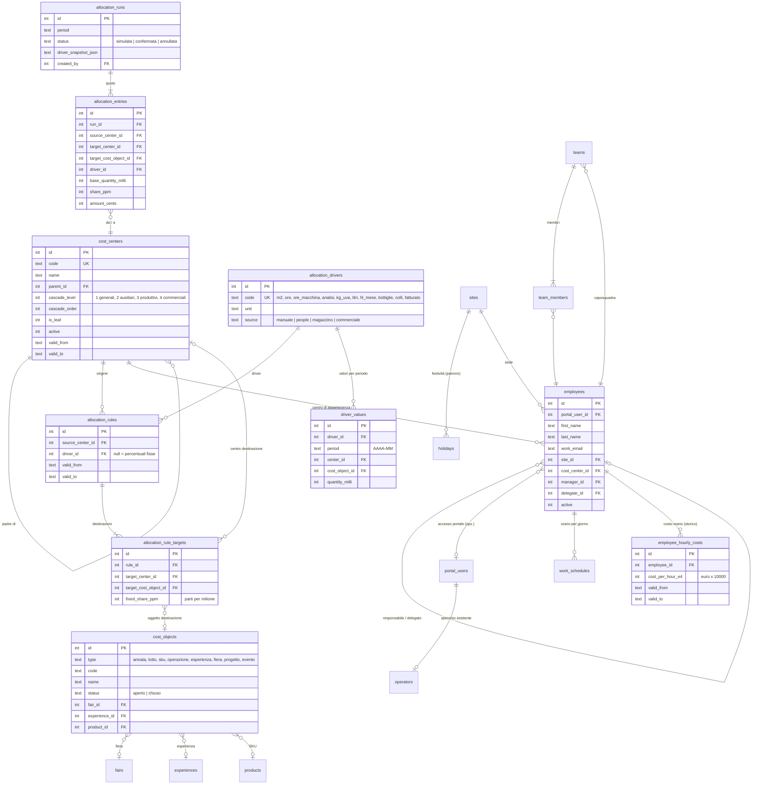
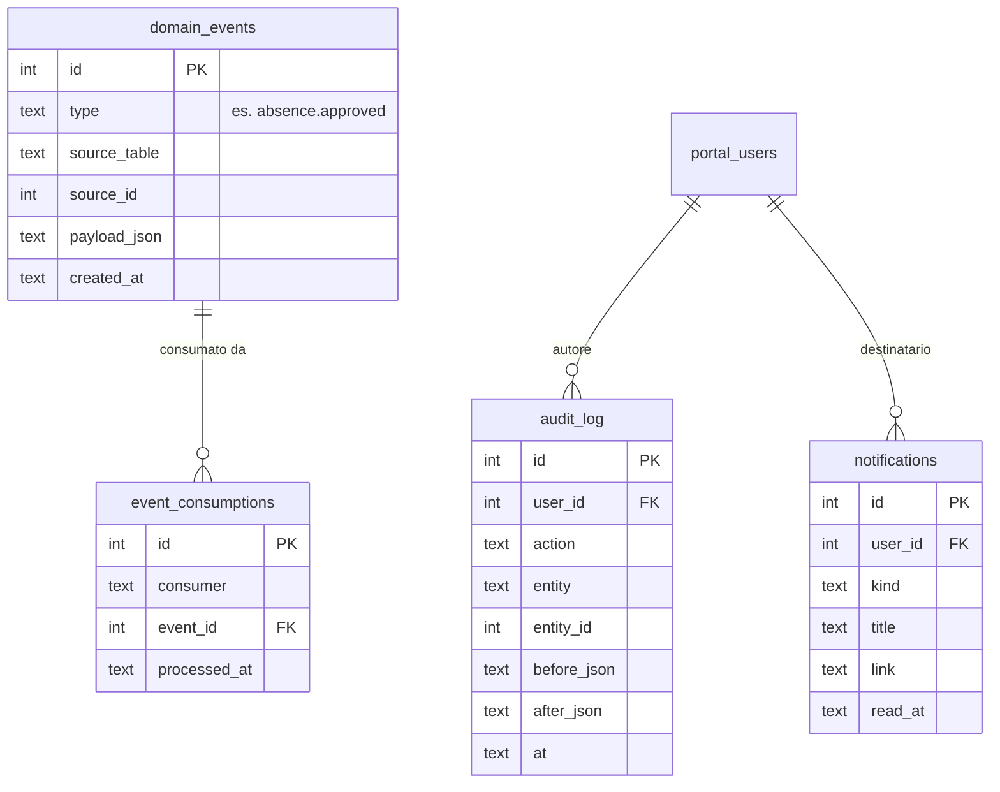

# People e Finance — Fase 0: audit e piano

Stato: **in attesa di decisioni** (nessuna modifica a codice o schema in questa fase).
Base dell'audit: repository `cantina-booking` al commit `476a80f` e ambiente Railway `production` (24/09/2026).

---

## 1. Esito dell'audit: com'è davvero il sistema

| Voce | Cosa diceva il documento | Cosa c'è davvero | Impatto su People/Finance |
|---|---|---|---|
| Motore DB | SQLite, obiettivo Postgres | **SQLite** (`node:sqlite`, API **sincrona** `DatabaseSync`). File `/data/cantina.db` su volume Railway da 50 GB (808 MB usati). Nel progetto Railway non c'è nessun Postgres. | Vedi decisione **D1**. |
| Dipendenza da SQLite | — | 451 `db.prepare`, 157 `db.exec`, 44 `datetime('now','localtime')`, `julianday`, `strftime`, `INSERT OR IGNORE`, `lastInsertRowid`. Tutte le route presuppongono query sincrone. | Passare a Postgres (driver asincrono) vuol dire riscrivere ogni route, non solo le query. |
| Migrazioni | — | **Nessuno strumento.** Lo schema si crea all'avvio con `CREATE TABLE IF NOT EXISTS` e `ALTER TABLE` in try/catch. Le migrazioni dei dati sono funzioni una tantum dentro `server.js`. Niente versioni, niente rollback. | Serve un runner versionato con baseline (**D2**). |
| Test | — | **Nessuno**: niente script di test né framework. | Serve un harness prima di scrivere regole QUANDO/ALLORA (**D3**). |
| Job in background | — | **Nessuno** (niente cron né `setInterval`). | Escalation al delegato, scadenzario e conservazione dei dati hanno bisogno di job (**D8**). |
| Notifiche | — | Solo email (Gmail SMTP o Resend). **In produzione nessun provider è configurato**: oggi non parte nessuna email. Nessuna notifica dentro l'app. | Serve un centro notifiche nell'app più l'email (**D7**). |
| Autenticazione | — | Utente e password (scrypt), poi il server rilascia una `access_key` **fissa e senza scadenza**, salvata nel browser. La chiave master `ADMIN_PASSWORD` è accettata anche nell'URL (`?key=`) e **viene stampata in chiaro nei log di avvio in produzione**. | Non adatto a dati HR e sanitari (**D5**). |
| Permessi | ruoli con workspace | La tabella `roles.workspaces` esiste, ma i permessi sono applicati **solo nell'interfaccia**. Il server non controlla il workspace: qualunque utente attivo può chiamare tutte le API. | **Bloccante** per il fascicolo HR e i livelli di riservatezza (**D5**). |
| File | — | Allegati CRM, fiere e cataloghi stanno sul volume `/data` (persistenti). **Le foto di prodotti ed esperienze stanno in `public/uploads` dentro il container e si perdono a ogni deploy.** Verificato: l'unica foto prodotto in produzione risponde 404. Nessuna cifratura, nessun URL firmato. | Serve uno storage per i documenti HR (**D4**); il bug delle foto va corretto comunque. |
| Stripe / email in produzione | — | Non configurati: le prenotazioni restano "richiesta" da confermare a mano. | La riconciliazione Stripe della Fase 5 non ha dati finché Stripe non è attivo. |
| Numero tabelle | 45 | **50**. | — |
| `products.stock_quantity` | seconda giacenza scollegata | **Già dismessa**: non è più letta né scritta. L'unica giacenza è `warehouse_finished.quantity`, scaricata in automatico da cassa e ritiri online. | La Fase 3 ha una giacenza in meno da riconciliare. |
| Movimenti di magazzino | nessuna tabella | Confermato: si aggiorna solo la quantità. **Gli ordini B2B non scaricano il magazzino.** | Serve la Fase 3 per il costo del venduto. |
| `sales_targets` | obiettivi | Sostituita (era vuota) da `sales_target_years`, `sales_target_year_areas` e `sales_target_products`, in bottiglie **ed euro**, per cantina, area e prodotto. | Il budget ricavi della Fase 4 può leggere direttamente gli euro, senza bottiglie × listino. |
| `b2c_customers`, `b2c_orders`, `contacts` | anagrafiche | **Deprecate**, non più scritte. L'anagrafica unica delle persone fisiche è `people` (Persone), collegata alle aziende tramite `person_links`. | Finance deve collegarsi a `people`, non a `b2c_customers`. |
| `crm_deals` | previsione ricavi | La tabella esiste, ma "Affari" è stato tolto dall'interfaccia. | La regola "gli affari aperti alimentano la previsione" oggi non ha dati. |
| Impostazioni | — | Esiste `settings` (chiave-valore) e la sezione **Customizations** per modulo. | Qui vanno i parametri configurabili di People e Finance. |
| `operators` | specchio di `portal_users` | Confermato (`syncOperatorForPortalUser`). | Il collegamento dipendente → operatore passa da `portal_user_id`. |

### Dove vengono scritti oggi i dati che Finance dovrà leggere

| Dato | Chi lo scrive |
|---|---|
| `orders.payment_status`, `paid_at` | Solo `PATCH /api/admin/orders/:id/payment` (manuale). |
| `orders.payment_due_date` | Alla creazione dell'ordine (manuale e da agente): data ordine + primo numero dei termini di pagamento del cliente. |
| `orders.status` (nuovo → in_lavorazione → sospeso → evaso) | `PATCH /api/admin/orders/:id` (kanban Magazzino). |
| Giacenza bottiglie | `adjustWarehouseStock()`: vendita in cassa (−), ritiro online pagato (−), eliminazione (+), modifica manuale in Magazzino. |
| Vendite in cassa | `POST /api/admin/shop-sales`. |
| Prenotazioni pagate | Webhook Stripe e conferma manuale (`/api/admin/bookings/confirm/:id`). |
| Ritiri online pagati | Webhook Stripe (stato `da_ritirare`). |

---

## 2. Decisioni da prendere prima della Fase 1

**D1 — Motore del database.**
- **A. Restare su SQLite adesso**: le nuove tabelle usano SQL portabile (date calcolate in JavaScript, niente funzioni SQLite nelle query nuove, importi interi) dietro uno strato dati sottile. Il passaggio a Postgres diventa un progetto a sé.
- **B. Migrare prima a Postgres**: riscrivere l'accesso ai dati da sincrono ad asincrono in tutte le route, migrare i dati, verificare tutto senza test esistenti. È il rischio più alto di tutto il piano.
- *Proposta: A.* Prima costruiamo test e migrazioni (D2, D3): sono proprio ciò che rende sicura la B più avanti.

**D2 — Strumento di migrazione.** I tool comuni (knex, Prisma, ecc.) non supportano `node:sqlite`, e il progetto evita apposta le dipendenze native.
- *Proposta:* un runner minimo interno, con `migrations/NNNN_nome.js` (`up`/`down`), una tabella `schema_migrations` e ogni migrazione eseguita in transazione all'avvio.
- Come prima cosa si registra la baseline `0001` con lo schema attuale. Da lì in poi, niente più `ALTER` sparsi in `server.js`.

**D3 — Test.** *Proposta:* `node:test`, già incluso in Node 24 e senza dipendenze, con un database temporaneo per ogni esecuzione. Serve una piccola modifica a `server.js`: esportare `app` senza avviarlo quando è importato dai test.
- I primi test coprono gli automatismi che esistono già: Persone, wine club, magazzino, obiettivi. Così People e Finance non rompono ciò che funziona.

**D4 — Storage dei documenti HR** (CV, contratti, cedolini, attestati, idoneità).
- **A. Railway Bucket** (S3-compatibile, nello stesso progetto), con URL firmati che scadono dopo pochi minuti. Per i documenti *sanitario* e *disciplinare* si aggiunge una cifratura applicativa (AES-256-GCM, chiave in variabile d'ambiente).
- **B. Volume `/data`** già esistente, con la stessa cifratura applicativa e download tramite token firmato a scadenza.
- *Proposta: A.* Sullo stesso storage si spostano anche le foto di prodotti ed esperienze, che oggi si perdono.

**D5 — Sicurezza degli accessi** (prerequisito per qualsiasi dato HR):
1. Permessi per workspace controllati **dal server** su ogni API, non solo dall'interfaccia.
2. Livelli di riservatezza (base, personale, retributivo, sanitario, disciplinare) controllati dal server su ogni campo e documento.
3. Sessioni con scadenza al posto della chiave fissa.
4. La chiave master fuori dai log e fuori dagli URL.
5. Log degli accessi ai dati sanitari.

Il punto 1 cambia il comportamento attuale: un utente che oggi, via API, vede dati fuori dai suoi workspace non li vedrà più.

**D6 — Dipendenti e Persone.** Un dipendente è una persona fisica, ma i dati HR hanno finalità e livelli di accesso diversi dal CRM.
- *Proposta:* `employees` separata da `people`, collegata a `portal_users` quando il dipendente ha accesso al portale. Nessun collegamento automatico con il CRM.

**D7 — Notifiche.** *Proposta:* una tabella `notifications` con la campanella nel portale, più l'email quando un provider è configurato. Oggi in produzione non ce n'è nessuno, quindi senza la campanella nessuno riceverebbe gli avvisi.

**D8 — Job.** *Proposta:* uno scheduler interno (un solo processo, ogni ora) con job idempotenti e una tabella `job_runs`. Basta per escalation, scadenzario e conservazione. Un servizio cron separato su Railway si può aggiungere dopo.

**D9 — Perimetro e ordine.** Il documento descrive una suite HR, una contabilità analitica e una contabilità generale con fatturazione elettronica. *Proposta di ordine:*
1. Prerequisiti (sezione 3).
2. Fase 1 completa.
3. Fase 2 "core": fascicolo con dati personali, rapporto di lavoro, sicurezza, documenti e scadenzario; timesheet; assenze.
4. Recruiting, valutazione e disciplinare più avanti.
5. La Fase 5 solo dopo aver scelto l'intermediario SDI, che è un costo e una scelta commerciale.

**D10 — Precisione dei decimali.** *Proposta:*
- costi orari e costi unitari in interi da 1/10.000 di euro;
- percentuali di ribaltamento in parti per milione;
- quantità dei driver in millesimi;
- sempre interi, mai float;
- regola "resto sull'ultima quota" in una sola funzione testata.

---

## 3. Prerequisiti tecnici proposti (prima della Fase 1)

| # | Cosa | Perché |
|---|---|---|
| P1 | Runner di migrazioni + baseline `0001` | Regola vincolante 3 |
| P2 | Harness di test `node:test` + test di regressione sugli automatismi esistenti | Regola 8, e non rompere i moduli attuali |
| P3 | Autorizzazione lato server per workspace, sessioni con scadenza, chiave fuori da log e URL | Regola 11 / GDPR |
| P4 | Infrastruttura eventi: `domain_events` (outbox) + `event_consumptions` con vincolo unico (consumer, evento) + dispatcher nel processo | Regola 9 |
| P5 | `audit_log` | Regola 10 |
| P6 | `notifications` + scheduler `job_runs` | Scadenzario, escalation |
| P7 | Correzione delle foto prodotti/esperienze sullo storage persistente | Bug trovato nell'audit |

---

## 4. Modello dati (ERD)

### Fase 1 — dettaglio

### Infrastruttura trasversale (P4–P6)

### Fasi 2–5 — tabelle previste (dettaglio nelle rispettive fasi)

- **Fase 2 — People**:
  - fascicolo: `employee_personal` (livello personale), `employee_emergency_contacts`, `identity_documents` (incluso il permesso di soggiorno), `employment_contracts` (versionati, mai sovrascritti), `compensation` (retributivo), `employee_languages`, `qualifications`;
  - sicurezza: `training_types`, `training_records`, `role_requirements` (mansione → formazione), `medical_visits` (solo giudizio e limitazioni), `sensitive_access_log`, `ppe_deliveries`, `incidents`;
  - documenti e beni: `hr_documents` (tipo, livello, chiave sullo storage), `assigned_assets`, `checklists` / `checklist_items`, `retention_rules`;
  - tempi: `timesheet_entries`, `timesheet_months`, `absence_types`, `absence_requests`, `absence_balances`;
  - più avanti: `candidates`.
- **Fase 3 — Magazzino**: `stock_movements` (tipo, quantità, costo unitario e4, FK al documento d'origine), `stock_valuation` (costo medio ponderato per articolo).
- **Fase 4 — Analitica**: `analytic_periods`, `analytic_entries` (centro, oggetto, natura, origine, FK al documento), `budgets`, `commission_rules`.
- **Fase 5 — Generale**: `accounts` (piano dei conti con mappa verso natura e centro), `party_accounting` (dati contabili collegati a clienti, importatori, fornitori, agenti e `people`, senza duplicarli), `journal_entries` / `journal_lines`, `vat_codes`, `invoices` / `invoice_lines` (attive e passive), `receivables` (scadenzario), `payments`, `bank_transactions`, `stripe_payouts`, `accounting_periods`.

---

## 5. Catalogo degli eventi di dominio

| Evento | Emittente | Consumer | Effetto |
|---|---|---|---|
| `absence.approved` | People → Assenze | Timesheet, Contatori, Notifiche | Righe timesheet nei giorni lavorativi (orario + festività della sede), contatore aggiornato, notifica. Tutto in una transazione. |
| `absence.cancelled` | People → Assenze | Timesheet, Contatori | Rimuove le righe generate e ripristina il contatore; se il mese è chiuso, blocco e richiesta di rettifica. |
| `sickness.reported` | People → Assenze | Timesheet, Notifiche | Entra subito nel timesheet e avvisa il responsabile. |
| `timesheet.month_approved` | People → Timesheet | Finance → Analitica | Costo del personale: ore × costo orario per centro e oggetto (una sola volta). |
| `employee.role_changed` | People → Fascicolo | Sicurezza, Scadenzario | Ricalcola la formazione mancante e propone la visita per cambio mansione. |
| `employee.offboarded` | People → Fascicolo | Auth, Enoturismo | Disattiva l'accesso al portale e l'operatore (senza cancellarli). |
| `incident.recorded` | People → Sicurezza | Assenze | Crea l'assenza "Infortunio" collegata, con il numero INAIL. |
| `booking.operator_assigned` | Enoturismo | People | Controlla assenze, lingua e idoneità; propone la riga di timesheet. |
| `booking.checked_in` | Enoturismo | Magazzino | Propone lo scarico delle bottiglie in degustazione (da confermare). |
| `sale.recorded` / `pickup.paid` / `order.fulfilled` | Enoturismo, Commerciale | Magazzino | Scarico valorizzato → `stock.issued`. |
| `stock.issued` | Magazzino | Finance → Analitica | Costo del venduto su canale, cliente e ordine. |
| `allocation.run_confirmed` | Finance → Cascata | Finance → Analitica | Movimenti delle quote ribaltate. |
| `invoice.confirmed` | Finance → Generale | Analitica, Scadenzario | Ricavo sul centro del canale o dell'area; partita cliente aperta. |
| `receivable.collected` | Finance → Scadenzario | Commerciale, Provvigioni | Lo stato di pagamento dell'ordine diventa un dato derivato; maturano le provvigioni se configurato. |
| `supplier_invoice.confirmed` | Finance → Generale | Magazzino, Scadenzario | Partita fornitore; carico delle materie prime se la riga corrisponde a un articolo. |
| `stripe.payout_reconciled` | Finance → Banca | Scadenzario, Generale | Chiude gli incassi collegati e registra la commissione. |
| `period.closed` | Finance | Tutti gli emittenti | Blocca le scritture con data in quel periodo. |
| `lot.created` / `lot.blended` / `lot.loss` / `lot.bottled` | Produzione (futura) | Finance → Lotti | Contratto da rispettare: accumulo dei costi, assemblaggi pro quota, cali, passaggio allo SKU. |

Chiave di idempotenza: `(consumer, event_id)`. Ogni evento nasce nella stessa transazione del documento che lo genera (outbox).

---

## 6. Piano delle migrazioni

1. `0001_baseline`: lo schema attuale, preso da `sqlite_master`. Non modifica un database esistente, lo registra come già applicato.
2. `0002_infra`: `schema_migrations`, `domain_events`, `event_consumptions`, `audit_log`, `notifications`, `job_runs`.
3. `0003_authz`: livelli di riservatezza e permessi dettagliati per ruolo; nuovi workspace `people` e `finance`.
4. Fase 1: `0010_cost_centers` (+ seed di default modificabile), `0011_allocation`, `0012_cost_objects`, `0013_org` (sedi, festività con il patrono di Pescara il 10/10, dipendenti, orari, squadre, costo orario).
5. Ogni migrazione ha il suo `down`. Prima di ogni migrazione in produzione si fa una copia del database sul volume.

## 7. Piano dei test

- **Unit**:
  - cascata: aciclicità, saldo zero, quadratura al centesimo con resto sull'ultima quota;
  - contatori delle assenze, giorni lavorativi con festività, costo orario, conversioni decimali.
- **Integrazione**: una per ogni regola QUANDO/ALLORA, via HTTP contro l'app avviata su un database SQLite reale temporaneo.
- **Regressione** sui moduli esistenti: Persone e collegamenti, wine club, scarico magazzino, obiettivi, prenotazioni.
- I test girano in locale prima di ogni deploy (si aggiunge al controllo pre-deploy già in uso).

## 8. Rischi

1. **Dati sanitari (art. 9 GDPR)**: con il fascicolo HR serve una valutazione d'impatto (DPIA) e il parere del consulente privacy. Il software può applicare i livelli d'accesso, ma la base giuridica e le regole di conservazione sono decisioni vostre.
2. **Sicurezza attuale** (permessi solo nell'interfaccia, chiave senza scadenza e presente nei log): da chiudere prima di caricare dati personali.
3. **Backup**: il database e gli allegati stanno su un solo volume. I backup del volume vanno verificati su Railway (non controllato in questo audit) e va previsto un export periodico.
4. **Perimetro molto ampio**: rischio di costruire molto prima di avere qualcosa di usabile. Per questo propongo l'ordine della D9.
5. **Fatturazione elettronica**: serve un intermediario SDI (costo e contratto) e la validazione degli XML con il commercialista.
6. **Collegamenti "per valore"** esistenti (`price_list_name`, `discount_code`, `customer_country` per le aree): Finance deve leggerli tramite funzioni dedicate e testate.
7. **Stripe ed email non attivi in produzione**: alcune regole (payout, notifiche email) non si possono verificare con dati reali finché non vengono attivati.
8. **SQLite sincrono**: per i volumi di una cantina va bene; i report pesanti vanno scritti con attenzione per non bloccare le altre richieste.

---

## 9. Cosa serve per partire

Le decisioni **D1–D10** (sezione 2). Con le proposte accettate, il primo blocco di lavoro sono i **prerequisiti P1–P7**; poi la **Fase 1**.
