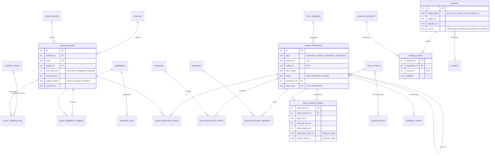
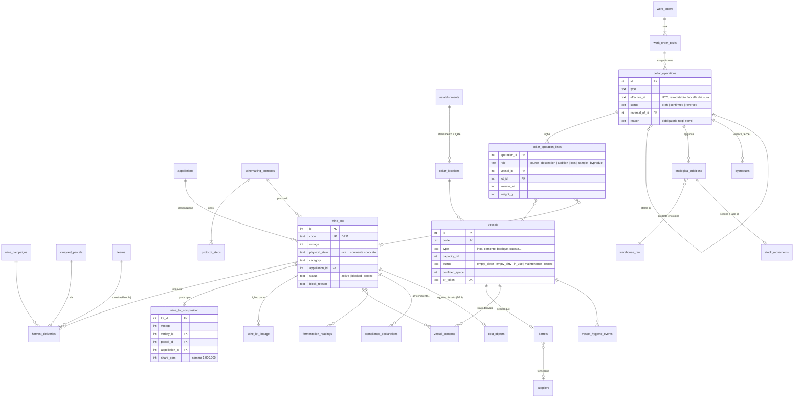
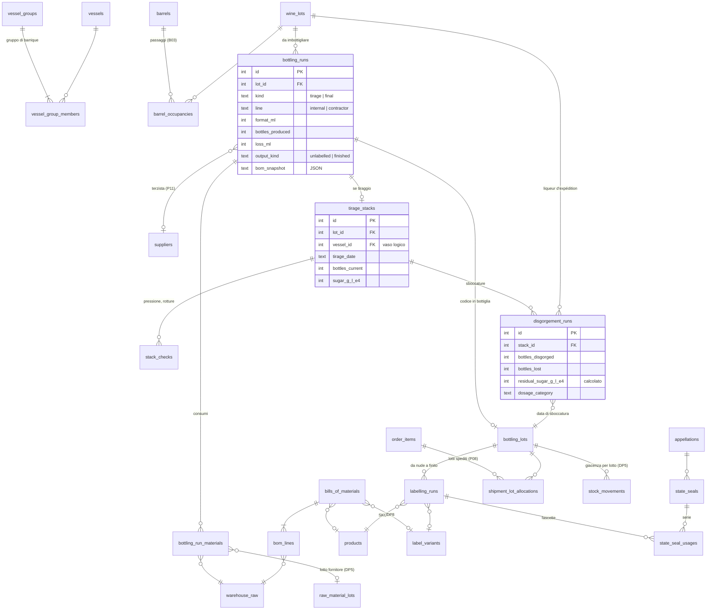
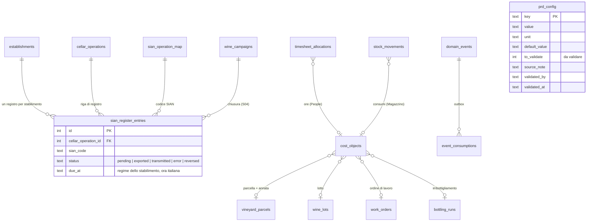

# Produzione — Fase 0: audit e piano

Stato: **in attesa di decisioni**. In questa fase non si modificano né il codice né lo schema.

Base dell'audit:
- repository `cantina-booking` al commit `262b909` (locale);
- ambiente Railway `production`, letto il 25/09/2026 in sola lettura tramite le API dell'admin.

Documenti collegati:
- [`eventi.md`](eventi.md): catalogo degli eventi e proposta del **contratto v1** con Finance;
- [`regole.md`](regole.md): tutte le regole PRD-xxx con il test previsto.

---

## 1. Esito dell'audit: com'è davvero il sistema

| Voce | Cosa dice il documento | Cosa c'è davvero | Impatto su Produzione |
|---|---|---|---|
| Motore DB | Postgres su Railway | **SQLite** (`node:sqlite`, sincrono) in locale e su Railway (`/data/cantina.db` sul volume). Nel progetto Railway non c'è nessun Postgres. Il 24/09 avete scelto di **restare su SQLite** (decisione D1 di People e Finance) | Vedi **DP1** |
| Migrazioni | da proporre se mancano | **Esistono**: runner versionato `migrations/NNNN_*.js` con `up`/`down`, copia del database prima di ogni migrazione. In locale siamo alla `0014` | Produzione parte dalla `0015` |
| Eventi | outbox da verificare | **Esistono**: `domain_events` (outbox nella stessa transazione) e `event_consumptions` (un consumer elabora un evento una volta sola). Mancano **versione dello schema** e **attore** | Vedi **DP2** |
| Test | da proporre | **Esistono**: `node:test`, database SQLite temporaneo per ogni esecuzione, 123 test via HTTP | Stesso impianto, con l'ID della regola nel nome del test |
| Audit trail | su tutte le tabelle | `audit_log` generale + `created_at`/`created_by` sulle tabelle nuove. `updated_at`/`updated_by` e `archived_at` non sono uno standard | Produzione li mette ovunque, come chiede la regola 9 |
| Fuso orario | Europe/Rome | **Tutto in UTC.** Le date si calcolano con `toISOString()`. Su Railway la variabile `TZ` non è impostata, quindi anche `datetime('now','localtime')` è UTC. Tra mezzanotte e l'1 (le 2 d'estate) la «data di oggi» è quella di ieri | Vedi **DP6** |
| Repository | GitHub | `github.com/dantemarramiero/cantina-booking`. Il `main` locale è **13 commit avanti** rispetto a GitHub. Railway si pubblica con `railway up` dalla cartella locale, non da GitHub | GitHub oggi non è la fonte di verità: conviene allinearlo (solo su vostra richiesta) |
| Tabelle | 45 | 121 in locale, dopo le Fasi 1–3 di People e Finance | — |
| Frontend | admin.html / portal.html | HTML + JS vanilla, senza bundler. Il portale carica moduli `public/js/portal-*.js` con gli aiuti comuni di `portal-ui.js`. **Nessuna libreria** per QR, PDF o mappe. Nessun manifest né service worker | Vedi **DP9** |
| Permessi | solo `workspaces` | Workspace controllati dal server (`lib/security.js`) + livelli di riservatezza HR (`roles.access_levels`). Nessun permesso per azione. **In produzione non c'è nessun ruolo**: oggi ogni utente vede tutto | Vedi **DP4** |

### 1.1 Dati reali in produzione (25/09/2026)

| Tabella | Contenuto |
|---|---|
| `orders` / `order_items` | **0 ordini, 0 righe** |
| `products` | **3**: «Altare» 2024 (Trebbiano, bianco), «Inferi» 2022, «Inferi» 2018. SKU vuoto su tutti e tre |
| `warehouse_raw` | **vuoto** |
| `warehouse_finished` | **vuoto** |
| `suppliers` | **0** |
| `roles` | **0** |
| `employees` | 2 attivi; nessuna squadra |
| `cost_centers` | albero di default più «P101 Vigneto — particella 1» sotto «P1 Vigneto» |
| `cost_objects` | 0 |

In pratica i dati di vigneto, cantina e magazzino oggi vivono **fuori dal software**, nei vostri fogli di calcolo. Due conseguenze:
- il rischio di rompere un uso esistente è basso, ma la regola 1 resta: nessun cambiamento ai moduli esistenti senza il vostro via;
- l'**import iniziale** (parcelle, vasi, barrique, vini in cantina, materie prime) è la parte che rende il modulo utilizzabile. Va progettato bene.

Qualità dei dati:
- in «Inferi» 2022 il campo vitigno contiene «Montepulciano D'Abruzzo», che è la **denominazione**;
- `products.vintage` è testo;
- i prodotti non hanno il **formato** (0,75 è implicito).

### 1.2 Stato di People e Finance (dipendenze)

| Pezzo | Stato | Dove | Uso in Produzione |
|---|---|---|---|
| Centri di costo a cascata | in produzione | `0004`, `modules/finance.js` | Centri P1 Vigneto, P02 Vinificazione, P03 Affinamento, P04 Imbottigliamento, A03 Laboratorio |
| Oggetti di costo | in produzione | `0005` | Tipi fissi, con un vincolo `CHECK`: annata, lotto, sku, operazione, esperienza, fiera, progetto, evento. **Mancano** parcella, ordine di lavoro e imbottigliamento, e un collegamento vero ai lotti. Vedi **DP3** |
| Dipendenti, sedi, squadre con caposquadra, costo orario | in produzione | `0008`, `modules/hr.js` | Squadre di vendemmia e potatura, esecutori |
| Sicurezza (2B) | in produzione | `0010`, `modules/hr-safety.js` | Nel catalogo ci sono già i corsi «fitosanitari» (D.Lgs. 150/2012) e «spazi confinati» (DPR 177/2011). Le abilitazioni si richiedono **per operazione** (`operation_trainings`); il giudizio di idoneità ha solo le limitazioni, collegate a mansioni o operazioni, **mai la diagnosi**. `assignmentCheck()` risponde «può lavorare su questa operazione a questa data?» |
| Presenze (2D) | in produzione | `0012`, `modules/hr-timesheet.js` | Ore ripartite su centri e oggetti di costo, ore di squadra dal caposquadra, righe proposte. Il posto per le proposte di Produzione è già previsto |
| Registro di magazzino valorizzato (Fase 3) | **pronto in locale, non pubblicato** | `0014`, `modules/stock.js` | Tipi `carico_produzione` e `consumo_produzione`, eventi `stock.issued` e `stock.received`. **Mancano** lotti e scadenze delle materie prime, semilavorati, giacenza per variante e per lotto d'imbottigliamento. Vedi **DP5** |
| Contabilità analitica con il costo del lotto (Fase 4 di Finance) | **non costruita** | — | Il contratto `lot.*` è solo **nominato** nel catalogo della Fase 0 di Finance; i contenuti non sono mai stati definiti. Lo propongo io in [`eventi.md`](eventi.md), e la Fase 4 di Finance lo implementerà |
| Fatture passive (Fase 5 di Finance) | non costruita | — | Terzisti, laboratori e acquisti di materie prime si registrano a mano finché non c'è |

### 1.3 Come si usano oggi le tabelle che Produzione toccherà

**`order_items.production_status`** (`da_produrre` | `in_produzione` | `completato`):
- nasce `da_produrre` (valore predefinito della colonna) per ogni riga: import da Excel, ordine manuale, portale agenti;
- **chi lo cambia:** solo `PATCH /api/admin/production/items/:id` (`server.js:5022`), dalla tendina di Produzione → Righe ordine (`portal.html:6274`). È manuale, lo può fare chiunque abbia il workspace Produzione e non lascia traccia nel registro attività;
- **chi lo legge:**
  - le pagine di Produzione (riepilogo, righe, dashboard);
  - **le dashboard Commerciale e Home**, che contano le righe «completato» come **bottiglie spedite** (`server.js:3421`, `server.js:3608`);
- **non è collegato a `orders.status`:** con la Fase 3 lo scarico di magazzino segue «evaso», non questo campo;
- dati reali: nessuno.

**`order_items.label_variant`:**
- testo libero: colonna `label_variant` o `etichetta` dell'import, ordine manuale, portale agenti;
- nessun catalogo e nessun valore reale.

**`warehouse_raw`:**
- vuoto;
- unità in testo libero (predefinita `pz`), quantità intera;
- niente lotti, scadenze, fornitore o categoria. Il costo arriva con la Fase 3.

**`warehouse_finished`:** vuoto; una riga per prodotto, senza variante né lotto.

**`products`:** 3 prodotti. `vintage` è testo, `wine_type` va bene, il formato non c'è. `stock_quantity` è dismesso, come già verificato.

**`suppliers.category`:** testo libero, 0 fornitori.

**Altro codice legato a «produzione»:**
- widget della dashboard (`server.js:2773`);
- `GET /api/admin/produzione/dashboard` (`server.js:3580`);
- `GET /api/admin/production/summary` e `/items` (`server.js:4979`).

Non ci sono job, eventi o tabelle di produzione.

### 1.4 Logiche implicite di oggi, in formato QUANDO/ALLORA (da validare)

| ID | Regola di oggi |
|---|---|
| PRD-X01 | QUANDO si crea una riga d'ordine (import, manuale, agente) ALLORA `production_status` = da produrre |
| PRD-X02 | QUANDO qualcuno cambia lo stato da Produzione → Righe ordine ALLORA lo stato cambia, senza altri effetti e senza traccia di chi l'ha fatto |
| PRD-X03 | QUANDO una riga è «completato» ALLORA le sue bottiglie contano come **spedite** nelle dashboard Commerciale e Home, anche se l'ordine non è evaso |
| PRD-X04 | QUANDO un ordine diventa «evaso» ALLORA si scaricano le bottiglie dal magazzino (Fase 3, non ancora in produzione), qualunque sia `production_status` |
| PRD-X05 | Il widget «Bottiglie da produrre» conta i **prodotti distinti** con righe non completate, non le bottiglie: l'etichetta è fuorviante |
| PRD-X06 | QUANDO una giacenza scende sotto soglia ALLORA parte un'email, solo se c'è un provider: in produzione non c'è, quindi non parte nulla. Nessun evento e nessuna notifica nel portale |

Da validare soprattutto la **X03**: se in Fase 6 il sistema porterà `production_status` a «completato» a fine etichettatura, quelle bottiglie risulterebbero «spedite» prima di partire. Vedi **DP7**.

---

## 2. Decisioni da prendere prima della Fase 1

**DP1 — Database.** Confermare per Produzione la decisione D1: si resta su SQLite, con SQL portabile.
- Volumi in ml, pesi in g, bottiglie e centesimi: `INTEGER` (in SQLite è a 64 bit, come `BIGINT`).
- **Valori analitici** (pH, g/l, °Brix, mg/l): *proposta*: interi × 10.000 (`value_e4`) con l'unità dal catalogo dei parametri. In SQLite `NUMERIC` diventa virgola mobile; l'intero è esatto, si confronta con le soglie senza sorprese e passa senza perdite a `NUMERIC` in Postgres.
- Date e ore in testo ISO UTC; JSON in testo.
- Il passaggio a Postgres resta un progetto a sé. I test che stiamo accumulando sono ciò che lo renderà sicuro.

**DP2 — Contratto degli eventi e outbox.**
- Approvare il **contratto v1** in [`eventi.md`](eventi.md), che vale anche per la Fase 4 di Finance.
- Aggiungere a `domain_events` due colonne, `schema_version` (predefinita 1) e `actor`. È una migrazione additiva sull'infrastruttura esistente: gli eventi di oggi restano versione 1 e nessun consumer cambia.

**DP3 — Oggetti di costo per Produzione.**
- Nuovi tipi:
  - `parcella` (per parcella e annata agraria, vedi DP13);
  - `ordine_lavoro`;
  - `imbottigliamento`;
  - più il collegamento vero di `lotto` al lotto di vino.
- In SQLite cambiare il `CHECK` dei tipi vuol dire **ricostruire la tabella `cost_objects`** (Finance, in produzione, oggi vuota). Si fa in una migrazione con copia dei dati e `down`.
- Da decidere: il centro **P101 «Vigneto — particella 1»**.
  - *Proposta:* il centro resta «P1 Vigneto» e le parcelle diventano **oggetti di costo**. Così si evita un centro per ogni parcella e la cascata resta leggibile.
  - *In alternativa:* un centro foglia per ogni parcella.

**DP4 — Permessi di Produzione.** Il workspace `produzione` resta la porta d'ingresso (controllata dal server). Dentro, *proposta*: una colonna `roles.capabilities` (elenco JSON) con queste capacità.

| Capacità | Può |
|---|---|
| `enologo` | approvare assemblaggi, aggiunte, designazioni, sblocchi; creare ordini di lavoro e protocolli |
| `cantiniere` | eseguire i task degli ordini di lavoro, registrare letture, travasi, colmature, igiene dei vasi |
| `capo_squadra` | registrare conferimenti e ore della squadra |
| `agronomo` | registrare e confermare interventi e trattamenti in vigneto |
| `responsabile_qualita` | bloccare e sbloccare lotti, tracciabilità, compliance, conferimenti in carenza (PRD-H02) |
| `sola_lettura` | consultare, senza scrivere |

- Utenti senza ruolo e chiave master hanno accesso completo, come oggi.
- Il controllo è sul server, per azione, con un test che rifiuta le API di Produzione senza capacità assegnata (come quello che esiste già per i workspace).

**DP5 — Magazzino per Produzione.** Serve in Fase 6, ma conviene decidere ora: la Fase 3 **non è ancora in produzione**, quindi il suo schema si può cambiare senza ricostruire tabelle piene.
1. **Lotti e scadenze delle materie prime critiche** (lieviti, batteri, enzimi, solfiti, bentonite; tappi con il lotto del fornitore per le indagini TCA). Si fa con una tabella `raw_material_lots` e il lotto indicato sul movimento.
2. **Semilavorati** (bottiglie nude, bottiglie di tiraggio in catasta): una terza famiglia di articoli oltre a prodotto e materia prima.
3. **Giacenza del finito per prodotto + variante + lotto d'imbottigliamento.**
- *Proposta:* aggiungere subito alla `0014` le colonne per variante, lotto d'imbottigliamento e semilavorato, prima della sua pubblicazione. Le tabelle collegate nasceranno nelle fasi di Produzione.
- Vincolo da rispettare: le materie prime usate da Produzione hanno unità **intere** (pz, g, ml), perché il registro aggiorna quantità intere.

**DP6 — Fuso orario.**
- Per Produzione, *proposta*: un solo modulo `lib/time.js`. Si salva in UTC; data operativa, scadenze, campagne e finestre normative si calcolano in ora italiana.
- Per i moduli esistenti propongo **a parte** la stessa correzione. Cambia un comportamento: una vendita alle 00:30 del 1° ottobre oggi viene datata 30 settembre.

**DP7 — `production_status`.**
- **Per ora non cambia nulla.**
- *Proposta per la Fase 6*, da attivare solo con il vostro via:
  - le transizioni automatiche dagli ordini di etichettatura (PRD-P09);
  - le dashboard «bottiglie spedite» leggono gli ordini **evasi** (Fase 3) invece di «completato».
- Domanda aperta: gli ordini hanno gli stati nuovo / in lavorazione / sospeso / evaso, e manca un «**confermato**». Quale stato fa partire la proposta di etichettatura?

**DP8 — Varianti di etichetta.**
- *Proposta:* un catalogo `label_variants` (codice, nome, mercato o lingua, cliente o importatore facoltativo).
- `order_items.label_variant` resta testo e si abbina al catalogo senza cambiare nulla per chi inserisce ordini.
- Il collegamento vero (una colonna nuova sulla riga d'ordine) si aggiunge solo con il vostro via.

**DP9 — Schermate.**
- **Gestione** nel portale, workspace Produzione: anagrafiche, mappa della cantina, schede di lotto e vaso, pianificazione, report. Stesso stile e stessi componenti di oggi (`portal-ui.js`).
- **Campo**: una pagina leggera per tablet e smartphone (`campo.html`), con la stessa sessione:
  - bottoni grandi, tastierino numerico, riepilogo prima/dopo;
  - vigneto: parcella in due tocchi, «ripeti l'ultimo intervento».
- **QR:** il codice contiene un indirizzo del portale. Si legge con la **fotocamera del telefono**, senza lettore nel browser (su iPhone non è affidabile), e apre la scheda del vaso con le azioni rapide.
  - Per generarli, *proposta*: una piccola libreria MIT copiata nel repository (`public/js/vendor/`), senza dipendenze nuove sul server.
- **Stampe** (ordine di lavoro, cartello vasca, etichetta barrique, scheda lotto, registro trattamenti, tracciabilità): pagine HTML pensate per la stampa e il «Salva come PDF», senza libreria PDF.
- **Offline (proposta, PWA):** solo per la pagina di campo in vigneto. Le **bozze** si salvano sul dispositivo con un identificativo unico e si inviano quando torna il segnale; il server le accetta una volta sola. La **conferma** avviene online, perché i controlli (patentino, dosi, carenze) hanno bisogno dei dati del server. Su iPhone la coda si svuota quando si riapre la pagina, non in background.
- **Mappa delle parcelle** (GeoJSON): più avanti, facoltativa. All'inizio basta l'elenco per vigneto.

**DP10 — Testi centralizzati.** Un dizionario italiano per le schermate di Produzione (`public/js/prd-i18n.js`) e uno per i messaggi del server (`modules/prd/messages.js`), pronti per l'inglese. Solo per Produzione: il resto del portale resta com'è.

**DP11 — Codici dei lotti.**
- *Proposta* in attesa della vostra numerazione attuale:
  - lotto di vino `{annata a 2 cifre}-{sigla}-{progressivo}`, es. `26-PEC-03`;
  - lotto d'imbottigliamento `L{anno a 2 cifre}{giorno giuliano}{progressivo}`, es. `L2626801`.
- Entrambi univoci e configurabili.

**DP12 — Configurazione normativa.**
- *Proposta:* una tabella `prd_config` a parte, non `settings`. Per ogni soglia tiene valore, unità, valore predefinito, fonte, «**da validare**», chi l'ha validata e quando.
- L'enologo e il consulente la rivedono da una pagina dedicata. Nessun limite di legge nel codice.

**DP13 — Annata agraria o campagna vitivinicola.** È un'ambiguità di dominio, per questo la sottopongo invece di decidere.
- La campagna va dal **1/8 al 31/7**. La stagione dei trattamenti e dei costi di vigneto va dalla potatura (inverno) alla vendemmia (settembre-ottobre), quindi **si divide tra due campagne**. Esempio: un trattamento del 5/8/2026 sulle uve 2026 cade nella campagna 2026/27, uno del 10/5/2026 nella 2025/26.
- La sigla del registro (SIAN, dichiarazioni) resta la campagna.
- *Proposta:*
  - per il vigneto contano l'**annata agraria** (anno di vendemmia) e l'anno solare. Il massimo di applicazioni per prodotto (PRD-V04) si conta per anno solare, come nelle etichette dei fitofarmaci. Il quaderno di campagna (PRD-S06) è per anno solare. Il costo di vigneto va su «parcella + annata»;
  - la campagna vitivinicola resta per la cantina e il registro.

**DP14 — Parcelle e catasto.** Anche questa è un'ambiguità di dominio.
- Il documento chiede che la somma delle superfici vitate sulla stessa particella non superi la superficie della particella (PRD-A01). Però la superficie della particella non è tra i campi previsti.
- Inoltre una parcella può corrispondere a **più** unità vitate, anche su particelle diverse.
- *Proposta:*
  - un elenco delle **particelle catastali** (comune, foglio, numero, subalterno, superficie);
  - un collegamento parcella ↔ particella con la superficie vitata e il codice dell'unità vitata dello schedario;
  - la superficie della parcella è la somma dei collegamenti.

**DP15 — Ordine delle fasi 3 e 4.**
- La Fase 3 registra già travasi, pressature e riempimenti, ma il motore delle operazioni è descritto nella Fase 4.
- *Proposta:* il **nucleo del motore** va nella Fase 3, insieme ai primi tipi di operazione. Il nucleo comprende:
  - giornale;
  - righe;
  - contenuto dei vasi;
  - composizione;
  - genealogia;
  - vincoli C01/C03/C04;
  - storni.

  La Fase 4 aggiunge gli altri tipi, la rivalidazione delle retrodatazioni (C02), gli ordini di lavoro e gli allarmi.
- Così non si scrive due volte la stessa logica.

**DP16 — Apertura della cantina.**
- La vendemmia 2026 è in corso adesso: il modulo non sarà pronto per registrarla dall'inizio.
- *Proposta:* un'operazione di **apertura**. Registra i vini oggi in cantina (vaso, volume, designazione, composizione dichiarata) come punto di partenza, con la data di avvio.
- Non va al SIAN, perché quei vini sono già nel vostro registro. È lo stesso principio dell'apertura del magazzino nella Fase 3.

---

## 3. Ordine di costruzione proposto

| # | Blocco | Perché in questo punto |
|---|---|---|
| 1 | **Pubblicare** il blocco 2E e la Fase 3 (magazzino valorizzato), dopo i vostri controlli | Le aggiunte enologiche (PRD-C08) e tutta la Fase 6 scaricano dal registro |
| 2 | **Prerequisiti di Produzione:** eventi v2 (DP2), `lib/time.js` (DP6), capacità (DP4), tipi di oggetto di costo (DP3), `prd_config` (DP12), testi (DP10), test «ogni regola ha il suo test» | Tutte le fasi li usano |
| 3 | **Fase 1** — anagrafiche e import CSV | Senza parcelle, vasi e barrique non si registra nulla |
| 4 | **Fase 2** — vigneto e trattamenti | **Urgente per legge:** dal 1° gennaio 2027 il registro dei trattamenti è solo elettronico, e i registri 2026 vanno convertiti entro il 31/12/2026 (vedi § 8 del documento). Mancano poco più di 3 mesi |
| 5 | **Fase 3** — vendemmia, lotti, nucleo del motore (DP15), apertura della cantina (DP16) | — |
| 6 | **Finance Fase 4** (analitica e costo del lotto) in parallelo con Produzione 4–5, sul contratto v1 | Finance lavora sugli eventi, non sulle tabelle di Produzione |
| 7 | **Fasi 4 → 8** di Produzione, nell'ordine del documento | — |
| — | SIAN via web-service (Fase 7, seconda parte) | Solo con il vostro via e dopo aver verificato chi trasmette oggi |

---

## 4. Modello dati (ERD)

I nomi seguono il § 6 del documento. Qui ci sono le relazioni e le colonne chiave; l'elenco completo delle colonne resta quello del documento, con le aggiunte motivate nelle decisioni. Tutte le tabelle hanno `created_at`, `created_by`, `updated_at`, `updated_by`; le anagrafiche hanno anche `archived_at`.

### 4.1 Vigneto

### 4.2 Vendemmia, lotti e cantina

### 4.3 Affinamento, metodo classico, imbottigliamento ed etichettatura

### 4.4 Compliance e collegamenti con gli altri moduli

---

## 5. Piano delle migrazioni

I numeri sono indicativi. Ogni migrazione ha il suo `down` ed è preceduta dalla copia automatica del database.

| Fase | Migrazione | Tabelle | Tabelle **esistenti** toccate |
|---|---|---|---|
| Prerequisiti | `0015_events_v2` | — | `domain_events`: + `schema_version`, + `actor` |
| Prerequisiti | `0016_prd_access` | `prd_config` | `roles`: + `capabilities` |
| Prerequisiti | `0017_cost_objects_v2` | — | `cost_objects`: **ricostruita** con i nuovi tipi (DP3) |
| 1 | `0018_prd_vineyard_master` | `vineyards`, `cadastral_parcels`, `vineyard_parcels`, `parcel_cadastral_links`, `grape_varieties`, `appellations`, `parcel_appellation_eligibility`, `appellation_rules`, `equipment`, `phyto_products`, `analysis_parameters` | — |
| 1 | `0019_prd_cellar_master` | `establishments`, `wine_campaigns`, `cellar_locations`, `vessels`, `barrels`, `winemaking_protocols`, `protocol_steps`, `sian_operation_map` | — |
| 2 | `0020_prd_interventions` | `parcel_interventions` e dettagli (parcelle, esecutori, mezzi, trattamento, concimazione), `analyses`, `analysis_results` | `timesheet_entries`: + collegamento all'intervento (proposte di ore) |
| 3 | `0021_prd_lots` | `harvest_deliveries`, `wine_lots`, `wine_lot_composition`, `wine_lot_lineage`, `cellar_operations`, `cellar_operation_lines`, `vessel_contents`, `byproducts`, `compliance_declarations` | `cost_objects`: + collegamento al lotto |
| 4 | `0022_prd_cellar_ops` | `enological_additions`, `fermentation_readings`, `cap_management_actions`, `work_orders`, `work_order_tasks`, `vessel_hygiene_events` | `timesheet_entries`: + collegamento al task; `stock_movements`: + lotto del materiale |
| 5 | `0023_prd_aging_sparkling` | `vessel_groups`, `vessel_group_members`, `barrel_occupancies`, `tirage_stacks`, `stack_checks`, `disgorgement_runs`, `dosage_categories` (tabella UE di partenza, da validare) | — |
| 6 | `0024_stock_v2` | `raw_material_lots`, semilavorati | `stock_movements`, `warehouse_raw` (categoria, lotti sì/no). **Se approvate DP5 ora, parte di questo va nella `0014` prima della pubblicazione** |
| 6 | `0025_prd_bottling` | `label_variants`, `bills_of_materials`, `bom_lines`, `bottling_runs`, `bottling_run_materials`, `bottling_lots`, `labelling_runs`, `state_seals`, `state_seal_usages`, `shipment_lot_allocations` | `products`: + formato in ml; `order_items`: + variante collegata (solo con il vostro via, DP7–DP8) |
| 7 | `0026_prd_compliance` | `sian_register_entries`, esportazioni del quaderno di campagna | `wine_campaigns`: chiusura |
| 8 | — | solo indici per i report, se servono | — |

---

## 6. Catalogo degli eventi

Il dettaglio, con i contenuti di ogni evento, è in [`eventi.md`](eventi.md). In sintesi:
- **Emessi da Produzione:**
  - `parcel.intervention_confirmed`, `phyto.treatment_confirmed`, `harvest.delivery_confirmed`;
  - `lot.created`, `lot.transferred`, `lot.split`, `lot.blended`, `lot.loss`, `lot.reversed`;
  - `lot.addition_confirmed`, `lot.analysis_recorded`, `lot.tirage`, `lot.disgorged`, `lot.bottled`;
  - `labelling.completed`, `barrel.occupancy_closed`, `workorder.completed`.
- **Consumati da Produzione:**
  - `timesheet.month_approved` e `timesheet.adjusted` (esistono già). **`timesheet.entry_approved` non esiste**: basta l'approvazione del mese;
  - `stock.below_threshold`: **non esiste**, oggi c'è solo l'email. Si aggiunge in `checkStockThreshold` come evento in più, senza cambiare l'email;
  - `order.confirmed`: **non esiste**, vedi DP7.
- **Per Finance:** i costi dei materiali passano da `stock.issued` del Magazzino, con l'oggetto di costo (lotto o imbottigliamento). Produzione non calcola costi.

---

## 7. Mappa delle integrazioni con il codice esistente

| Integrazione | Dove, oggi | Cosa si fa (e quando) |
|---|---|---|
| Stato di produzione delle righe | `server.js:5022` (PATCH), `portal.html:6274` | Fase 6, dopo il via: transizioni dagli ordini di etichettatura; registro attività sul cambio manuale |
| «Bottiglie spedite» | `server.js:3421` (Commerciale), `server.js:3608` (Home) | Proposta DP7: leggere gli ordini evasi |
| Pagine Produzione di oggi | `portal.html:903-918` (menu), `portal.html:1243-1270` (pannelli), `portal.html:3235` (caricamento), `server.js:2773` (widget), `server.js:3580`, `server.js:4979` | Restano; il menu si allarga con Vigneto, Cantina, Lotti, Imbottigliamento, Compliance |
| Permessi | `lib/security.js:116` (`production`, `produzione`) | Nuovi gruppi di API sotto il workspace `produzione` + capacità (DP4) |
| Registro di magazzino | `modules/stock.js`: `move()` (riga 104), tipi `LOADS`/`ISSUES` (righe 14-15), `syncWarehouse()` (riga 84) | Aggiunte, imbottigliamento, tiraggio, sboccatura, etichettatura e confezionamento usano `move()`. Produzione non scrive mai le quantità |
| Scarico degli ordini evasi | `modules/stock.js:202` (`orderStatusChanged`), chiamato da `server.js:3108` | Fase 6: lo scarico indica il lotto d'imbottigliamento (FIFO modificabile, PRD-P08) |
| Avviso di scorta | `server.js:1688` (`checkStockThreshold`) | Emette anche `stock.below_threshold` (additivo) |
| Controllo del personale | `modules/hr-safety.js:220` (`assignmentCheck`) | Trattamenti (V02, V10) e spazi confinati (C17). Oggi una limitazione collegata all'operazione è un **avviso** e il corso mancante ammette una **deroga**: per le abilitazioni di legge serve una modalità **bloccante senza deroghe**. È un'opzione nuova, da approvare, che non cambia i controlli di oggi |
| Abilitazioni per operazione | `migrations/0010_safety.js`: corsi «fitosanitari» e «spazi_confinati», tabella `operation_trainings` | Si creano gli oggetti di costo di tipo operazione «Trattamento fitosanitario» e «Ingresso in spazio confinato», con le abilitazioni richieste |
| Ore | `modules/hr-timesheet.js:353` (proposte: «le operazioni di Produzione si aggiungeranno…») | Proposte da interventi e task con l'oggetto di costo; nessun secondo sistema di ore |
| Squadre | `migrations/0008_org.js` (`teams`, `team_members`) | Conferimenti e interventi indicano la squadra |
| Oggetti di costo | `migrations/0005_cost_objects.js`, `modules/finance.js:9` (`OBJECT_TYPES`) | DP3 |
| Eventi | `lib/events.js:34` (`emit`) | Versione e attore (DP2) |
| Fornitori | `suppliers.category` (testo libero) | Tonnellerie, laboratori, terzisti: categorie suggerite, senza vincolo. Non conformità come nota CRM collegata al fornitore e al lotto del materiale |
| Enoturismo | `experience_products` | Nessuna modifica; API in sola lettura per le visite (descrizioni pubblicabili) |

---

## 8. Test

- **Stesso impianto di oggi:** `node:test`, un database SQLite temporaneo per ogni esecuzione, chiamate HTTP all'app vera. Niente container Postgres, per coerenza con DP1.
- **Nome del test = ID della regola:** `test('PRD-C01 un travaso oltre la capacità è rifiutato', …)`.
- **Test di copertura delle regole:** legge [`regole.md`](regole.md) e fallisce se una regola di una fase già consegnata non ha un test con il suo ID.
- **Fuso orario nei test:** il processo gira in UTC come Railway. I confini in ora italiana si provano in modo esplicito, per esempio le 23:30 UTC del 31/7, che in Italia sono già il 1° agosto e quindi la campagna nuova.
- **Contratto con Finance** (Fase 8): i contenuti degli eventi si verificano contro [`eventi.md`](eventi.md). Doppia consegna e storno non devono duplicare nulla.

---

## 9. Configurazioni di partenza (tutte da validare)

Vanno in `prd_config` (DP12). Sono **valori di partenza da far rivedere** all'enologo e al consulente, non indicazioni di legge.

| Chiave | Valore proposto | Regola | Fonte da verificare |
|---|---|---|---|
| Finestra delle fermentazioni | 15/7 → 31/12 | H05 | documento § 8; deroghe da disciplinare |
| Limite di acidificazione senza dichiarazione | 4 g/l in acido tartarico | C10 | documento § 8 |
| Soglia per indicare annata o vitigno | 85% | C06 | documento § 8 |
| Arresto di fermentazione | densità ferma per 48 h (calo minimo da definire) | C12 | enologo |
| Registrazione tardiva di un trattamento | 30 giorni | V08 | documento |
| Tempo minimo sui lieviti | 9 mesi, per tipologia e menzione | M02 | disciplinari delle vostre DO |
| Tolleranza di un travaso senza calo dichiarato | 0,5% del volume | C04 | enologo |
| SO2 totale e acidità volatile | soglie di attenzione e limiti per categoria (fermo, spumante, biologico, zuccheri residui) | C14 | normativa UE sulle pratiche enologiche |
| Categorie di dosaggio | tabella UE (pas dosé … dolce) con la tolleranza | M03 | normativa UE sull'etichettatura degli spumanti |
| Pressione minima per categoria | spumante, spumante di qualità | M05 | normativa UE |
| Resa massima uva/ha | dal disciplinare di ogni DO; per i vini generici 30 t/ha (40 dove previsto dalla Regione) | H03 | documento § 8, disciplinari |
| Analisi pre-imbottigliamento | parametri da definire, entro 30 giorni | P02 | enologo |
| Colmature | ogni 14 giorni | B01 | enologo |
| Barrique vuota senza solforazione | 21 giorni | B05 | enologo |
| Vita utile della barrique | 5 passaggi | B04 | enologo |
| Spazi confinati | almeno 2 persone abilitate | C17 | DPR 177/2011, RSPP |
| Scadenze del registro SIAN | ordinario: entrate entro il giorno lavorativo successivo, uscite entro il terzo; deroga: 30 giorni | S02 | documento § 8, regime dello stabilimento |
| Avviso prima della scadenza SIAN | 1 giorno lavorativo | S02 | — |

---

## 10. Rischi

1. **Perimetro molto ampio:** circa 60 tabelle nuove e 8 fasi. Per questo propongo di arrivare presto a qualcosa di usabile: anagrafiche e vigneto, con l'urgenza del registro elettronico dei trattamenti.
2. **Normativa:**
   - codici SIAN, disciplinari, limiti e categorie sono configurazione «da validare», non consulenza;
   - un valore sbagliato in `prd_config` produce controlli sbagliati. Serve la revisione dell'enologo e del consulente prima dell'uso reale.
3. **Doppia trasmissione al SIAN:** se oggi trasmette un CAA, un consulente o un altro software, MyWinery non deve mai farlo per lo stesso stabilimento. Fino alla Fase 7 parte 2 non trasmette nulla.
4. **Retrodatazioni** (PRD-C02): sono la parte più delicata del motore. Una riga inserita nel passato va rivalidata su tutti i vasi e lotti toccati da lì in avanti; il limite è la chiusura della campagna.
5. **Date:** Magazzino e Finance non ammettono retrodatazioni, la cantina sì. Esempio: un'aggiunta registrata oggi ma fatta la settimana scorsa.
   - Lo **scarico di magazzino** ha la data di oggi (regola della Fase 3).
   - L'**operazione di cantina** ha la data vera.
   - L'evento porta entrambe le date.
6. **Dati iniziali:** senza l'import di parcelle, vasi, barrique e vini in cantina il modulo resta vuoto. La qualità dei fogli di calcolo attuali determina i tempi.
7. **Fuso orario UTC** nei moduli esistenti (DP6): errori di data vicino alla mezzanotte, oggi già presenti.
8. **Registro di magazzino non ancora pubblicato:** Produzione dalla Fase 4 in poi dipende da lì.
9. **Offline:** le bozze possono arrivare in ritardo o in conflitto. Per questo la conferma resta online e ogni bozza ha un identificativo unico.
10. **Backup:** database e allegati stanno su un solo volume Railway. Il backup del volume va attivato o verificato; è già in sospeso dalla Fase 0 di Finance.
11. **SQLite sincrono:** la tracciabilità ricorsiva (PRD-S05) usa query ricorsive, che SQLite gestisce bene ai volumi di una cantina. I report pesanti vanno scritti con attenzione.

---

## 11. Domande per voi

Dal documento:
1. **Registro telematico SIAN:** chi lo tiene oggi (voi, un CAA, un consulente, un altro software)? C'è già qualcosa che trasmette?
2. **Stabilimenti con codice ICQRF:** quanti? Regime ordinario o deroga sotto i 1000 hl? Siete deposito fiscale?
3. **Denominazioni:** quali DO/IG producete? Quali richiedono i contrassegni di Stato?
4. **Biologico:** siete certificati o in conversione, anche solo su una parte dei vigneti?
5. **Terzisti:** l'imbottigliatrice è vostra o mobile/terzista? Remuage e sboccatura sono interni o conto terzi?
6. **Laboratorio:** interno, esterno o entrambi? In che formato arrivano i referti (PDF, CSV)?
7. **Unità a schermo:** hl o litri, quintali o kg, °Babo o °Brix.
8. **Numerazione attuale** dei lotti e dei lotti d'imbottigliamento (DP11).

Emerse dall'audit:

9. **Fogli di calcolo attuali:** di parcelle, vasi, barrique e vini in cantina. Me ne mandate un esempio per ciascuno, così preparo l'import (Fase 1) e l'apertura della cantina (DP16)?
10. **Vendemmia 2026:** a che punto è? Quando sarà finita, la registriamo come apertura (DP16) o volete ricostruirla conferimento per conferimento?
11. **Ordine «confermato»:** quale stato degli ordini lo rappresenta (DP7)?
12. **Codici SKU:** i 3 prodotti in produzione non hanno lo SKU e manca il formato. Chi li definisce? E l'elenco completo delle etichette per annata e formato?
13. **Centro P101 «Vigneto — particella 1»:** è un inizio di un centro per parcella, o va bene che le parcelle diventino oggetti di costo (DP3)?
14. **Dispositivi in cantina e in vigneto:** iPad, tablet Android, telefoni personali? Cambia cosa si può fare offline (DP9).
15. **Enologo consulente esterno:** deve avere un accesso al portale?
16. **Contratto con Finance** ([`eventi.md`](eventi.md)): va bene che la Fase 4 di Finance si costruisca su questo contratto, invece che su uno scritto da Finance da sola?
